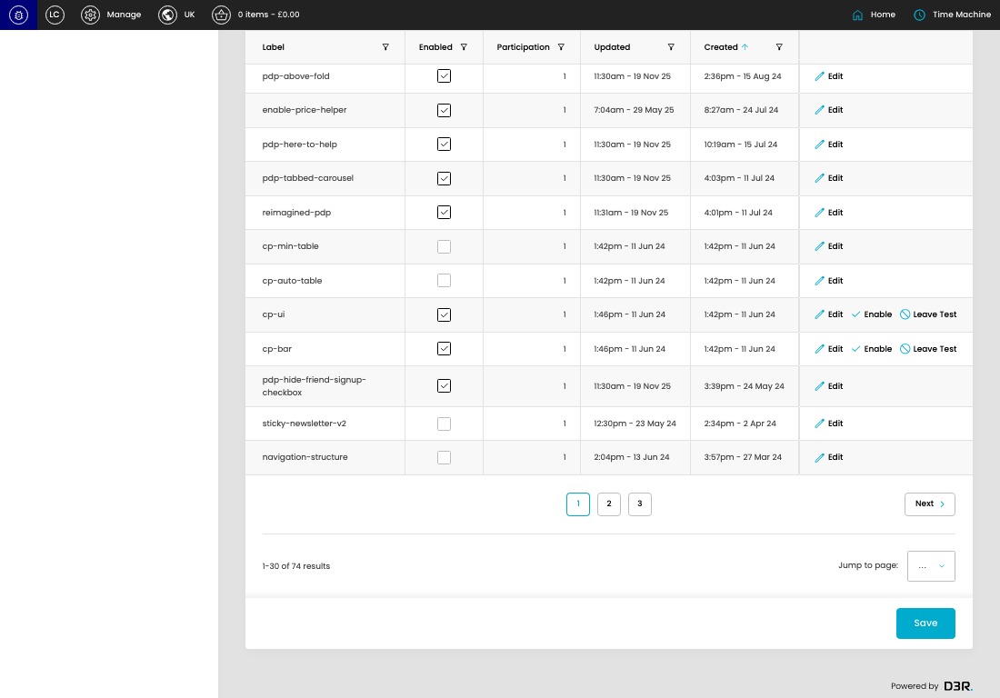
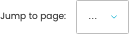

# Feature Flips

[Feature Flips overview](../../index.md) / Feature Flips listing

URL: [https://sohohome.com/cp/flipflop-admin](https://sohohome.com/cp/flipflop-admin)

This page covers Feature Flips.

*Feature Flips page overview*

## Using This Page

1. Open the Feature Flips page from the relevant navigation area or direct URL.
2. Use the listing to review existing Feature Flip entries.
3. Use the available create or edit actions to manage individual entries.

## What You Can Do

### Review existing entries

Use the listing to search, filter, and review existing Feature Flip entries.

- Column: Label
- Column: Enabled
- Column: Participation
- Column: Updated
- Column: Created

### Create a new entry

Select Create new to add a Feature Flip entry, then complete the labelled settings and save.

### Edit an existing entry

Open an existing Feature Flip entry to review or update its settings.

- Save applies the changes.

## Key Settings

The sections below highlight the settings people are most likely to change.

### listing-flipflop_trial-form

#### Trial Enabled

*Trial Enabled setting*

Set the Trial Enabled value for each relevant row in this section.

**Effect:** Updates Trial Enabled.

#### select

*select setting*

Choose the select from the available options.

**Effect:** Updates select.

**Options:** …, 1, 2, 3

## Available Actions

- Search
- Add filter
- Sort by Created
- Edit columns
- 2
- 3
- Next
- Save
