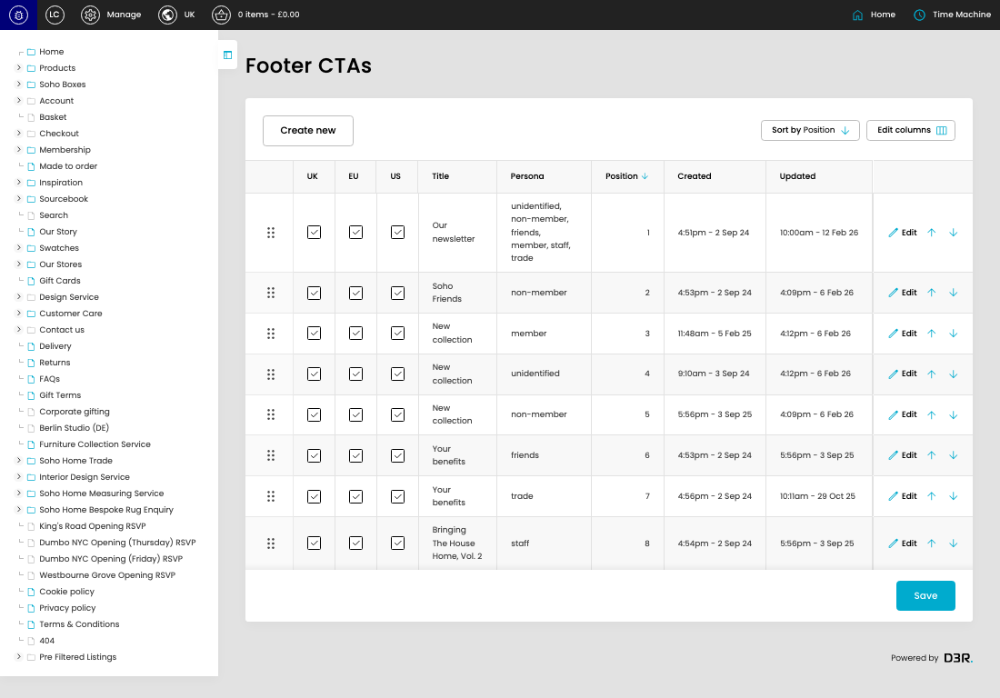

# Footer CTAs

[Footer CTAs overview](../../index.md) / Footer CTAs listing

URL: [https://sohohome.com/cp/footer-ctas-admin](https://sohohome.com/cp/footer-ctas-admin)

Use this page to manage Footer CTAs.

*Footer CTAs page overview*

## Using This Page

1. Open the Footer CTAs page from the relevant navigation area or direct URL.
2. Use the listing to review existing Footer CTA entries.
3. Use the available create or edit actions to manage individual entries.

## What You Can Do

### Review existing entries

Use the listing to search, filter, and review existing Footer CTA entries.

- Column: UK
- Column: EU
- Column: US
- Column: Title
- Column: Persona
- Column: Position
- Column: Created
- Column: Updated

### Create a new entry

Select Create new to add a Footer CTA entry, then complete the labelled settings and save.

### Edit an existing entry

Open an existing Footer CTA entry to review or update its settings.

- Save applies the changes.

## Key Settings

The sections below highlight the settings people are most likely to change.

### listing-footer_cta-form

#### Cta UK

*Cta UK setting*

Set the Cta UK value for each relevant row in this section.

**Effect:** Updates Cta UK.

#### Cta EU

*Cta EU setting*

Set the Cta EU value for each relevant row in this section.

**Effect:** Updates Cta EU.

#### Cta US

*Cta US setting*

Set the Cta US value for each relevant row in this section.

**Effect:** Updates Cta US.

## Available Actions

- Create new
- Sort by Position
- Edit columns
- Save
