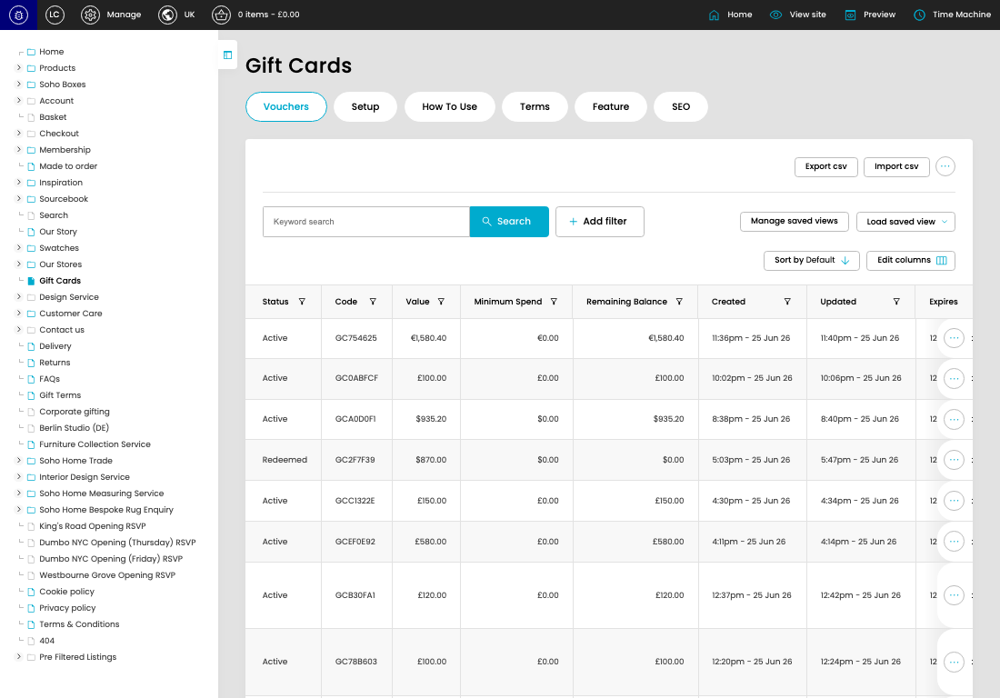
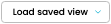

# Gift Cards

[Gift Cards overview](../../index.md) / Gift Cards listing

URL: [https://sohohome.com/cp/gift-cards](https://sohohome.com/cp/gift-cards)

This page covers Gift Cards.

*Gift Cards page overview*

## Using This Page

1. Open the Gift Cards page from the relevant navigation area or direct URL.
2. Use the listing to review existing Gift Card entries.
3. Use the available create or edit actions to manage individual entries.

## What You Can Do

### Review existing entries

Use the listing to search, filter, and review existing Gift Card entries.

- Column: Status
- Column: Code
- Column: Value
- Column: Minimum Spend
- Column: Remaining Balance
- Column: Created
- Column: Updated
- Column: Expires
- Column: Purchased By
- Column: From
- Column: Receipient's Name
- Column: Instance

### Create a new entry

Select Create new to add a Gift Card entry, then complete the labelled settings and save.

### Edit an existing entry

Open an existing Gift Card entry to review or update its settings.

- Save applies the changes.

## Key Settings

The sections below highlight the settings people are most likely to change.

### Gift Cards

#### select

*select setting*

Choose the select from the available options.

**Effect:** Updates select.

**Options:** Load saved view, GC liability MMW

## Available Actions

- Vouchers
- Setup
- How To Use
- Terms
- Feature
- SEO
- Export csv
- Import csv
- Search
- Add filter
- Manage saved views
- Sort by Default
- Edit columns
- 2
- 3
- 4
- 5
- Next
- Last
