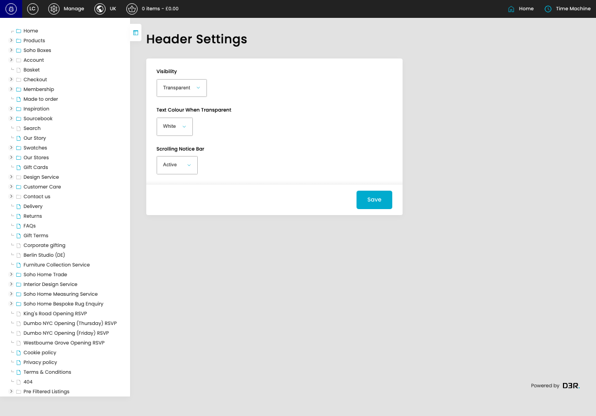

# Header Settings

[Header Settings overview](../../index.md) / Header Settings

URL: [https://sohohome.com/cp/header-settings](https://sohohome.com/cp/header-settings)

Use this page to manage Header Settings.

*Header Settings page overview*

## Using This Page

1. Open a Header Setting entry from the listing, or select Create new.
2. Complete the labelled settings for the entry.
3. Select Save to apply the changes.

## What You Can Do

### Create a new entry

Select Create new to add a Header Setting entry, then complete the labelled settings and save.

### Edit an existing entry

Open an existing Header Setting entry to review or update its settings.

- Save applies the changes.

## Key Settings

The sections below highlight the settings people are most likely to change.

### Header Settings

#### Visibility

*Visibility setting*

Choose the Visibility from the available options.

**Effect:** Updates Visibility.

**Options:** Standard, Transparent

#### Text Colour When Transparent

*Text Colour When Transparent setting*

Choose the Text Colour When Transparent from the available options.

**Effect:** Updates Text Colour When Transparent.

**Options:** Black, White

#### Scrolling Notice Bar

*Scrolling Notice Bar setting*

Choose the Scrolling Notice Bar from the available options.

**Effect:** Updates Scrolling Notice Bar.

**Options:** Active, Inactive

## Available Actions

- Save
