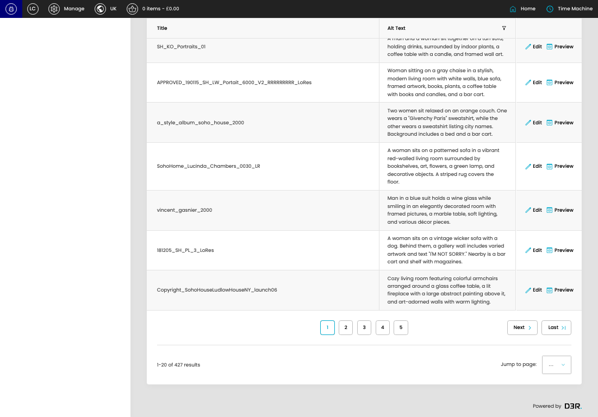
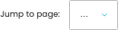

# Image Assets (Export/Import)

[Image Assets (Export/Import) overview](../../index.md) / Image Assets (Export/Import) listing

URL: [https://sohohome.com/cp/image-asset-admin](https://sohohome.com/cp/image-asset-admin)

This page covers Image Assets (Export/Import).

*Image Assets (Export/Import) page overview*

## Using This Page

1. Open the Image Assets (Export/Import) page from the relevant navigation area or direct URL.
2. Use the listing to review existing Image Assets (Export/Import) entries.
3. Use the available create or edit actions to manage individual entries.

## What You Can Do

### Review existing entries

Use the listing to search, filter, and review existing Image Assets (Export/Import) entries.

- Column: Title
- Column: Alt Text

### Create a new entry

Select Create new to add a Image Assets (Export/Import) entry, then complete the labelled settings and save.

### Edit an existing entry

Open an existing Image Assets (Export/Import) entry to review or update its settings.

## Key Settings

The sections below highlight the settings people are most likely to change.

### Image Assets (Export/Import)

#### select

*select setting*

Choose the select from the available options.

**Effect:** Updates select.

**Options:** …, 1, 2, 3, 4, 5, 6, 7, 8, 9, 10, 11, and 11 more

## Available Actions

- Pages
- Blocks
- Products
- Stores
- Miscellaneous
- Search
- Add filter
- Sort by Default
- Edit columns
- 2
- 3
- 4
- 5
- Next
- Last
