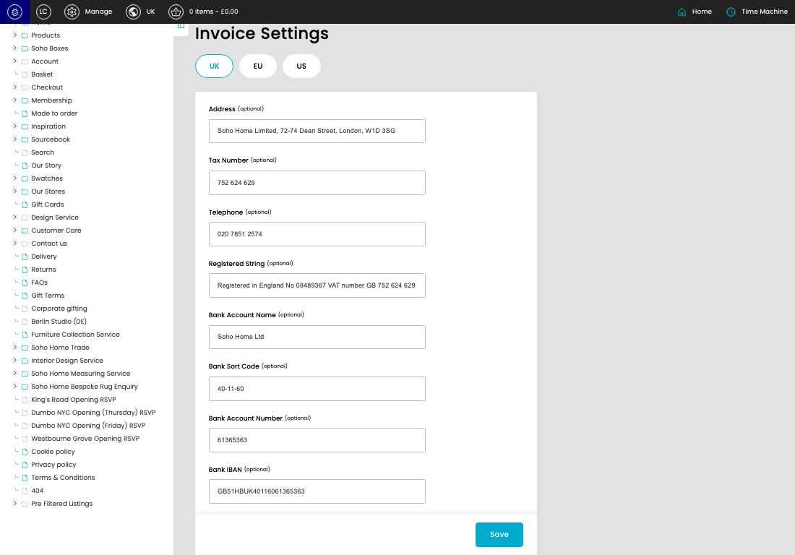
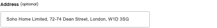
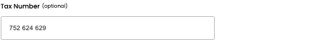
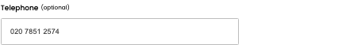
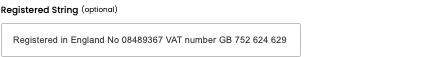
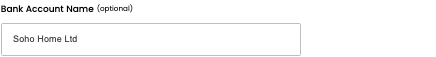
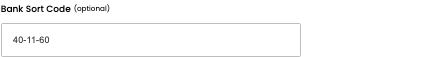
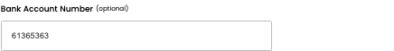
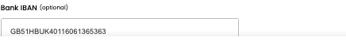

# Invoice Settings

[Invoice Settings overview](../../index.md) / Invoice Settings

URL: [https://sohohome.com/cp/invoice-settings-admin](https://sohohome.com/cp/invoice-settings-admin)

Use this page to manage Invoice Settings.

*Invoice Settings page overview*

## Using This Page

1. Open a Invoice Setting entry from the listing, or select Create new.
2. Complete the labelled settings for the entry.
3. Select Save to apply the changes.

## What You Can Do

### Create a new entry

Select Create new to add a Invoice Setting entry, then complete the labelled settings and save.

### Edit an existing entry

Open an existing Invoice Setting entry to review or update its settings.

- Save applies the changes.

## Key Settings

The sections below highlight the settings people are most likely to change.

### Invoice Settings

#### Address (optional)

*Address (optional) setting*

Enter the Address (optional).

**Effect:** Updates Address.

**Notes:** optional

#### Tax Number (optional)

*Tax Number (optional) setting*

Enter the Tax Number (optional).

**Effect:** Updates Tax Number.

**Notes:** optional

#### Telephone (optional)

*Telephone (optional) setting*

Enter the Telephone (optional).

**Effect:** Updates Telephone.

**Notes:** optional

#### Registered String (optional)

*Registered String (optional) setting*

Enter the Registered String (optional).

**Effect:** Updates Registered String.

**Notes:** optional

#### Bank Account Name (optional)

*Bank Account Name (optional) setting*

Enter the Bank Account Name (optional).

**Effect:** Updates Bank Account Name.

**Notes:** optional

#### Bank Sort Code (optional)

*Bank Sort Code (optional) setting*

Enter the Bank Sort Code (optional).

**Effect:** Updates Bank Sort Code.

**Notes:** optional

#### Bank Account Number (optional)

*Bank Account Number (optional) setting*

Enter the Bank Account Number (optional).

**Effect:** Updates Bank Account Number.

**Notes:** optional

#### Bank IBAN (optional)

*Bank IBAN (optional) setting*

Enter the Bank IBAN (optional).

**Effect:** Updates Bank IBAN.

**Notes:** optional

#### Bank SWIFT Code (optional)

Enter the Bank SWIFT Code (optional).

**Effect:** Updates Bank SWIFT Code.

**Notes:** optional

## Available Actions

- UK
- EU
- US
- Save
