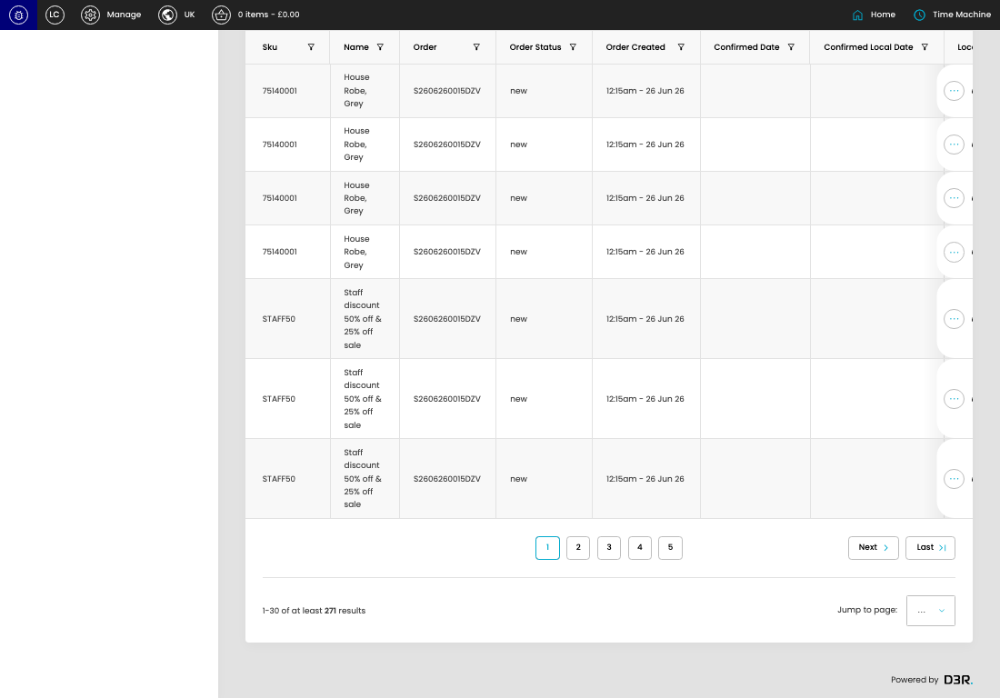
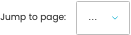

# Line Items :

[Line Items : overview](../../index.md) / Line Items : listing

URL: [https://sohohome.com/cp/line-item-admin](https://sohohome.com/cp/line-item-admin)

Use this page to manage Line Items : .

*Line Items : page overview*

## Using This Page

1. Open the Line Items : page from the relevant navigation area or direct URL.
2. Use the listing to review existing Line Items : entries.
3. Use the available create or edit actions to manage individual entries.

## What You Can Do

### Review existing entries

Use the listing to search, filter, and review existing Line Items : entries.

- Column: Sku
- Column: Name
- Column: Order
- Column: Order Status
- Column: Order Created
- Column: Confirmed Date
- Column: Confirmed Local Date
- Column: Locale
- Column: Shipment
- Column: Shipment Status
- Column: Markdown Saving
- Column: FOC Reason

### Create a new entry

Select Create new to add a Line Items : entry, then complete the labelled settings and save.

### Edit an existing entry

Open an existing Line Items : entry to review or update its settings.

- Save applies the changes.

## Key Settings

The sections below highlight the settings people are most likely to change.

### Line Items :

#### select

*select setting*

Choose the select from the available options.

**Effect:** Updates select.

**Options:** Load saved view, Embroidery, GC Refunds

#### select

*select setting*

Choose the select from the available options.

**Effect:** Updates select.

**Options:** …, 1, 2, 3, 4, 5, 6, 7, 8, 9, 10

## Available Actions

- All
- Open Orders
- Export csv
- Add filter
- Manage saved views
- Sort by Default
- Edit columns
- 2
- 3
- 4
- 5
- Next
- Last
