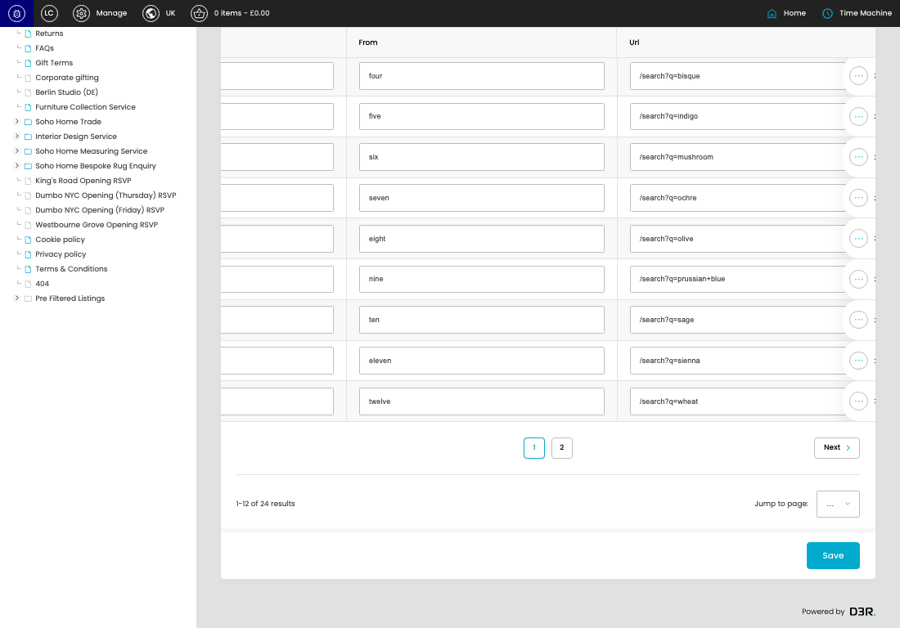
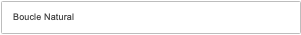
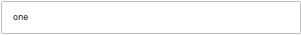
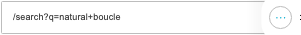

# Links

[Links overview](../../index.md) / Links listing

URL: [https://sohohome.com/cp/links-admin](https://sohohome.com/cp/links-admin)

Use this page to manage Links.

*Links page overview*

## Using This Page

1. Open the Links page from the relevant navigation area or direct URL.
2. Use the listing to review existing Link entries.
3. Use the available create or edit actions to manage individual entries.

## What You Can Do

### Review existing entries

Use the listing to search, filter, and review existing Link entries.

- Column: Name
- Column: From
- Column: Url

### Create a new entry

Select Create new to add a Link entry, then complete the labelled settings and save.

### Edit an existing entry

Open an existing Link entry to review or update its settings.

- Save applies the changes.

## Key Settings

The sections below highlight the settings people are most likely to change.

### listing-link-form

#### Link Name

*Link Name setting*

Set the Link Name value for each relevant row in this section.

**Effect:** Updates Link Name.

**Validation:** Required.

#### Link Urlname

*Link Urlname setting*

Set the Link Urlname value for each relevant row in this section.

**Effect:** Updates Link Urlname.

#### Link Url

*Link Url setting*

Set the Link Url value for each relevant row in this section.

**Effect:** Updates Link Url.

**Validation:** Required.

#### select

*select setting*

Choose the select from the available options.

**Effect:** Updates select.

**Options:** …, 1, 2

## Available Actions

- Create new
- Search
- Sort by Default
- Edit columns
- 2
- Next
- Save
