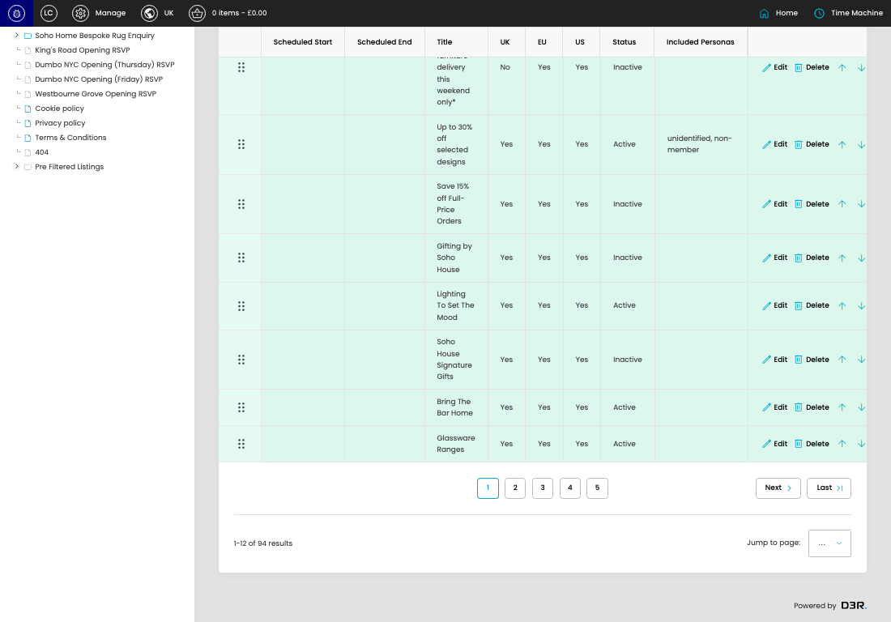

# Listing callouts

[Listing callouts overview](../../index.md) / Listing callouts listing

URL: [https://sohohome.com/cp/listing-callouts-admin](https://sohohome.com/cp/listing-callouts-admin)

Use this page to manage Listing callouts.

*Listing callouts page overview*

## Using This Page

1. Open the Listing callouts page from the relevant navigation area or direct URL.
2. Use the listing to review existing Listing callout entries.
3. Use the available create or edit actions to manage individual entries.

## What You Can Do

### Review existing entries

Use the listing to search, filter, and review existing Listing callout entries.

- Column: Scheduled Start
- Column: Scheduled End
- Column: Title
- Column: UK
- Column: EU
- Column: US
- Column: Status
- Column: Included Personas

### Create a new entry

Select Create new to add a Listing callout entry, then complete the labelled settings and save.

### Edit an existing entry

Open an existing Listing callout entry to review or update its settings.

## Key Settings

The sections below highlight the settings people are most likely to change.

### Listing callouts

#### select

*select setting*

Choose the select from the available options.

**Effect:** Updates select.

**Options:** …, 1, 2, 3, 4, 5, 6, 7, 8

## Available Actions

- Create new
- Export csv
- Search
- Sort by Default
- Edit columns
- 2
- 3
- 4
- 5
- Next
- Last
