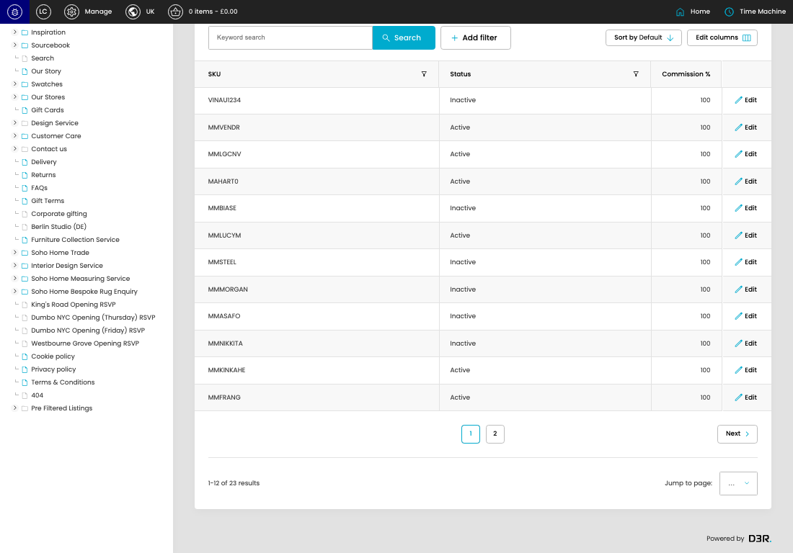

# Member Market Product SKUs

[Member Market Product SKUs overview](../../index.md) / Member Market Product SKUs listing

URL: [https://sohohome.com/cp/member-market-products-admin](https://sohohome.com/cp/member-market-products-admin)

Use this page to manage Member Market Product SKUs.

*Member Market Product SKUs page overview*

## Using This Page

1. Open the Member Market Product SKUs page from the relevant navigation area or direct URL.
2. Use the listing to review existing Member Market Product SKU entries.
3. Use the available create or edit actions to manage individual entries.

## What You Can Do

### Review existing entries

Use the listing to search, filter, and review existing Member Market Product SKU entries.

- Column: SKU
- Column: Status
- Column: Commission %

### Create a new entry

Select Create new to add a Member Market Product SKU entry, then complete the labelled settings and save.

### Edit an existing entry

Open an existing Member Market Product SKU entry to review or update its settings.

## Key Settings

The sections below highlight the settings people are most likely to change.

### Member Market Product SKUs

#### select

*select setting*

Choose the select from the available options.

**Effect:** Updates select.

**Options:** …, 1, 2

## Available Actions

- Create new
- Export csv
- Search
- Add filter
- Sort by Default
- Edit columns
- 2
- Next
