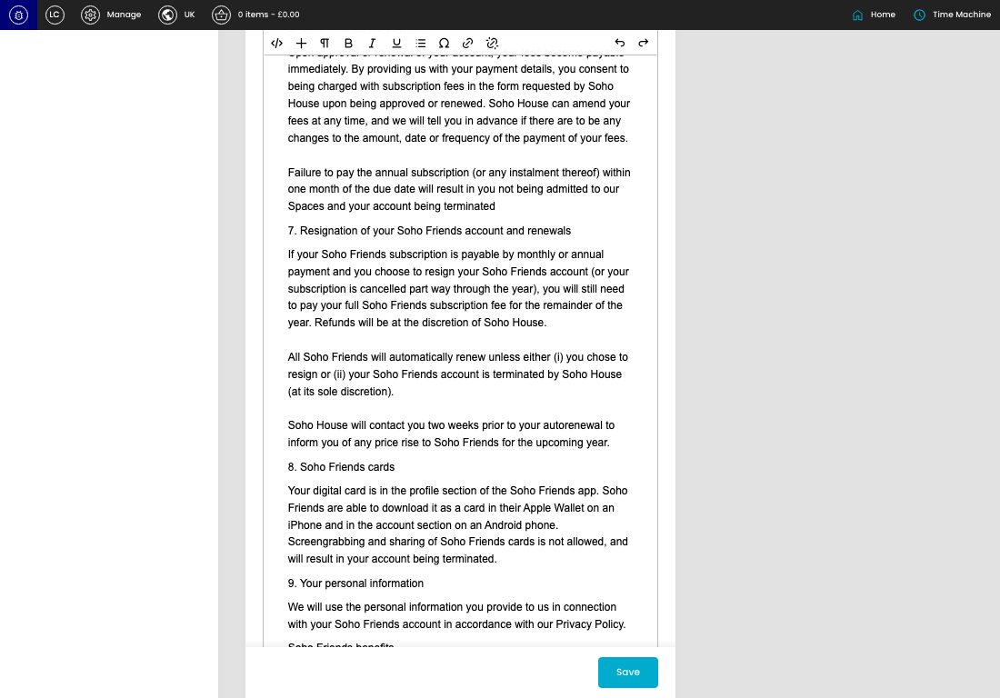

# Membership Application Settings

[Membership Application Settings overview](../../index.md) / Membership Application Settings

URL: [https://sohohome.com/cp/membership-application-settings-admin](https://sohohome.com/cp/membership-application-settings-admin)

Use this page to manage Membership Application Settings.

*Membership Application Settings page overview*

## Using This Page

1. Open a Membership Application Setting entry from the listing, or select Create new.
2. Complete the labelled settings for the entry.
3. Select Save to apply the changes.

## What You Can Do

### Create a new entry

Select Create new to add a Membership Application Setting entry, then complete the labelled settings and save.

### Edit an existing entry

Open an existing Membership Application Setting entry to review or update its settings.

- Save applies the changes.

## Key Settings

The sections below highlight the settings people are most likely to change.

### 1. Soho Friends

#### Terms - No Auto-renew

*Terms - No Auto-renew setting*

Enter the Terms - No Auto-renew content.

**Effect:** Updates Terms - No Auto-renew.

#### Terms - Auto-renew

*Terms - Auto-renew setting*

Enter the Terms - Auto-renew content.

**Effect:** Updates Terms - Auto-renew.

## Available Actions

- Save
