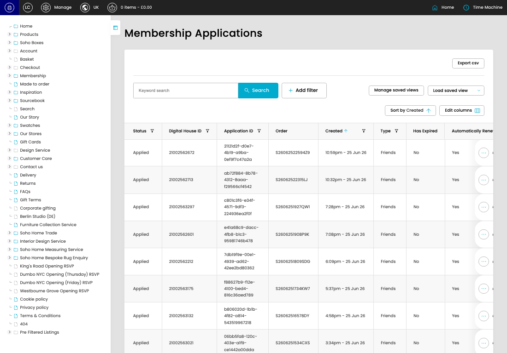

# Membership Applications

[Membership Applications overview](../../index.md) / Membership Applications listing

URL: [https://sohohome.com/cp/membership-applications](https://sohohome.com/cp/membership-applications)

This page covers Membership Applications.

*Membership Applications page overview*

## Using This Page

1. Open the Membership Applications page from the relevant navigation area or direct URL.
2. Use the listing to review existing Membership Application entries.
3. Use the available create or edit actions to manage individual entries.

## What You Can Do

### Review existing entries

Use the listing to search, filter, and review existing Membership Application entries.

- Column: Status
- Column: Digital House ID
- Column: Application ID
- Column: Order
- Column: Created
- Column: Type
- Column: Has Expired
- Column: Automatically Renew Membership?

### Create a new entry

Select Create new to add a Membership Application entry, then complete the labelled settings and save.

### Edit an existing entry

Open an existing Membership Application entry to review or update its settings.

- Save applies the changes.

## Key Settings

The sections below highlight the settings people are most likely to change.

### Membership Applications

#### select

*select setting*

Choose the select from the available options.

**Effect:** Updates select.

**Options:** Load saved view, New, Unsent Applications

## Available Actions

- Export csv
- Search
- Add filter
- Manage saved views
- Sort by Created
- Edit columns
- 2
- 3
- 4
- 5
- Next
- Last
