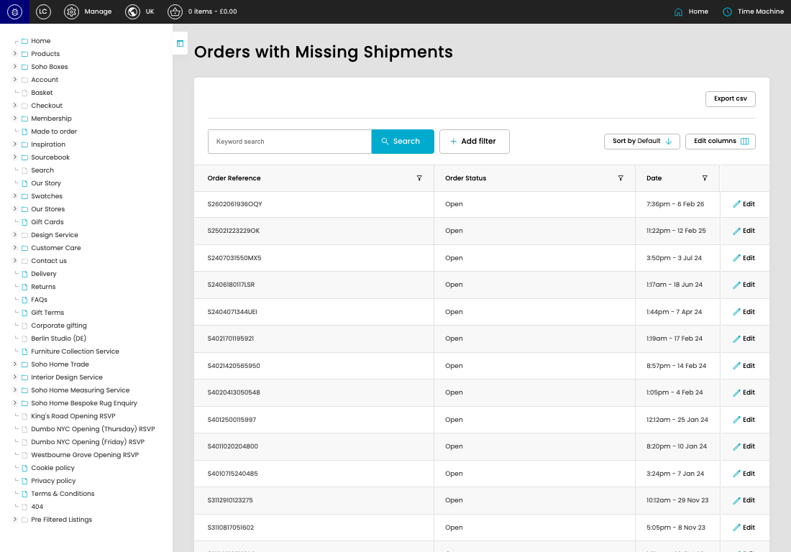

# Orders with Missing Shipments

[Orders with Missing Shipments overview](../../index.md) / Orders with Missing Shipments listing

URL: [https://sohohome.com/cp/missing_shipments-admin](https://sohohome.com/cp/missing_shipments-admin)

Use this page to manage Orders with Missing Shipments.

*Orders with Missing Shipments page overview*

## Using This Page

1. Open the Orders with Missing Shipments page from the relevant navigation area or direct URL.
2. Use the listing to review existing Orders with Missing Shipment entries.
3. Use the available create or edit actions to manage individual entries.

## What You Can Do

### Review existing entries

Use the listing to search, filter, and review existing Orders with Missing Shipment entries.

- Column: Order Reference
- Column: Order Status
- Column: Date

### Create a new entry

Select Create new to add a Orders with Missing Shipment entry, then complete the labelled settings and save.

### Edit an existing entry

Open an existing Orders with Missing Shipment entry to review or update its settings.

## Available Actions

- Export csv
- Search
- Add filter
- Sort by Default
- Edit columns
