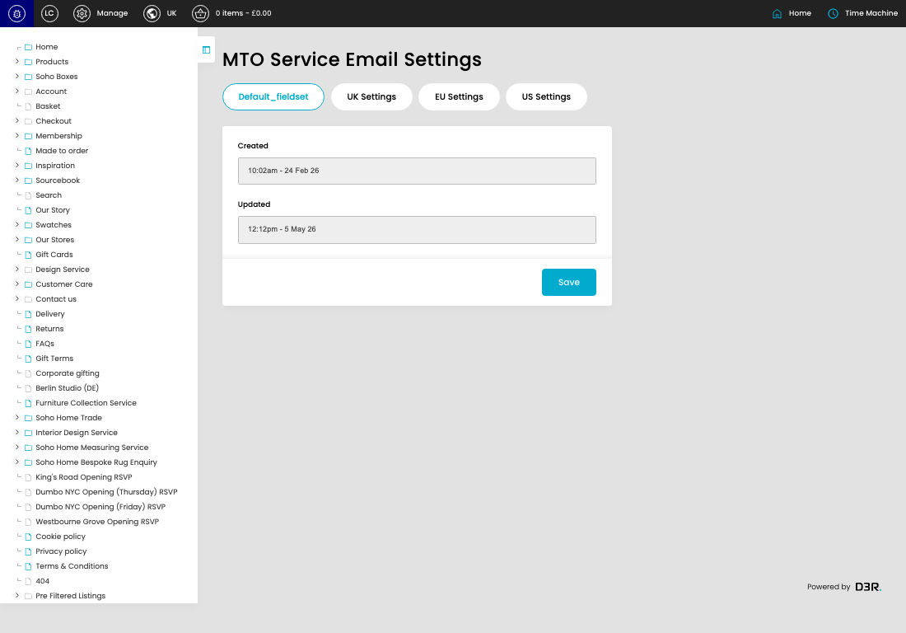

# MTO Service Email Settings

[MTO Service Email Settings overview](../../index.md) / MTO Service Email Settings

URL: [https://sohohome.com/cp/mto-service-email-settings-admin](https://sohohome.com/cp/mto-service-email-settings-admin)

Use this page to manage MTO Service Email Settings.

*MTO Service Email Settings page overview*

## Using This Page

1. Open a MTO Service Email Setting entry from the listing, or select Create new.
2. Complete the labelled settings for the entry.
3. Select Save to apply the changes.

## What You Can Do

### Create a new entry

Select Create new to add a MTO Service Email Setting entry, then complete the labelled settings and save.

### Edit an existing entry

Open an existing MTO Service Email Setting entry to review or update its settings.

- Save applies the changes.

## Available Actions

- Default_fieldset
- UK Settings
- EU Settings
- US Settings
- Save
