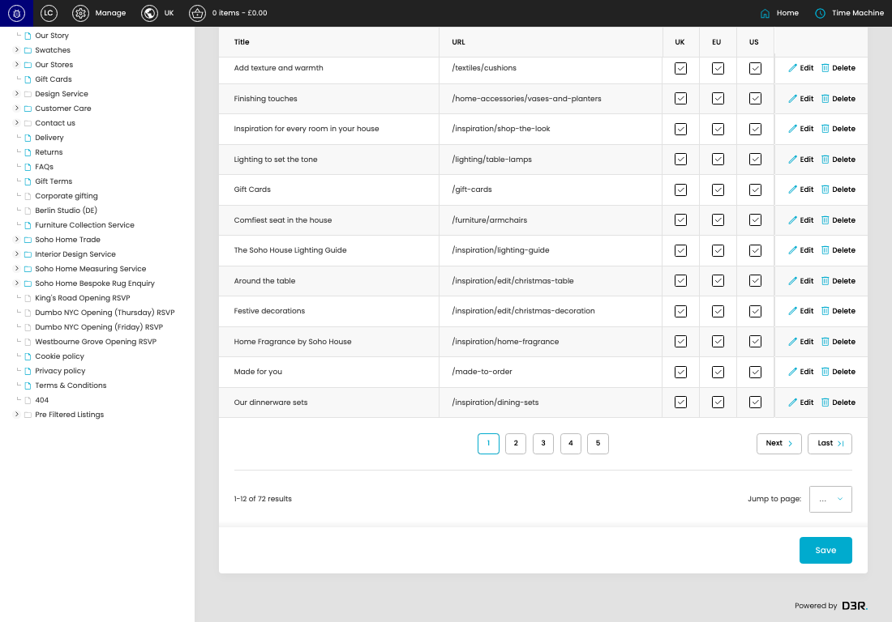

# Navigation Callouts

[Navigation Callouts overview](../../index.md) / Navigation Callouts listing

URL: [https://sohohome.com/cp/nav-callouts-admin](https://sohohome.com/cp/nav-callouts-admin)

Use this page to manage Navigation Callouts.

*Navigation Callouts page overview*

## Using This Page

1. Open the Navigation Callouts page from the relevant navigation area or direct URL.
2. Use the listing to review existing Navigation Callout entries.
3. Use the available create or edit actions to manage individual entries.

## What You Can Do

### Review existing entries

Use the listing to search, filter, and review existing Navigation Callout entries.

- Column: Title
- Column: URL
- Column: UK
- Column: EU
- Column: US

### Create a new entry

Select Create new to add a Navigation Callout entry, then complete the labelled settings and save.

### Edit an existing entry

Open an existing Navigation Callout entry to review or update its settings.

- Save applies the changes.

## Key Settings

The sections below highlight the settings people are most likely to change.

### listing-navcallout-form

#### Nav Callout UK

*Nav Callout UK setting*

Set the Nav Callout UK value for each relevant row in this section.

**Effect:** Updates Nav Callout UK.

#### Nav Callout EU

*Nav Callout EU setting*

Set the Nav Callout EU value for each relevant row in this section.

**Effect:** Updates Nav Callout EU.

#### Nav Callout US

*Nav Callout US setting*

Set the Nav Callout US value for each relevant row in this section.

**Effect:** Updates Nav Callout US.

#### select

*select setting*

Choose the select from the available options.

**Effect:** Updates select.

**Options:** …, 1, 2, 3, 4, 5, 6

## Available Actions

- Create new
- Search
- Sort by Default
- Edit columns
- 2
- 3
- 4
- 5
- Next
- Last
- Save
