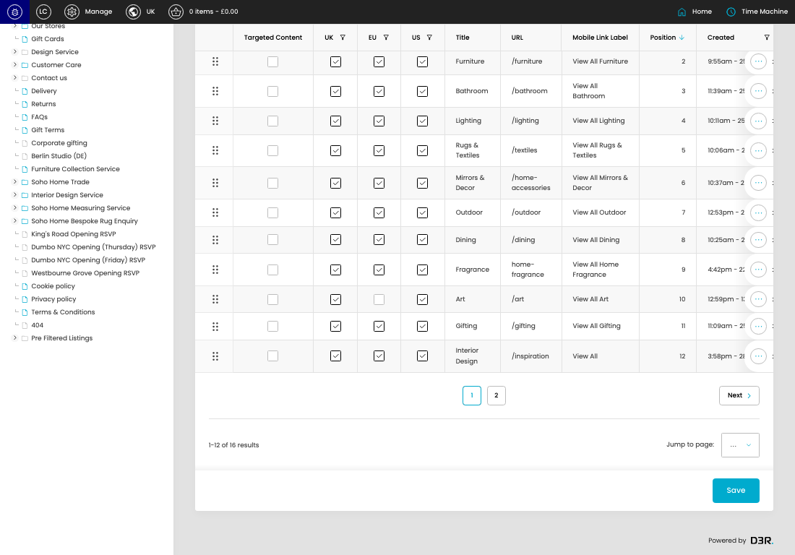

# Navigation

[Navigation overview](../../index.md) / Navigation listing

URL: [https://sohohome.com/cp/navigation-admin-v1](https://sohohome.com/cp/navigation-admin-v1)

This page covers Navigation.

*Navigation page overview*

## Using This Page

1. Open the Navigation page from the relevant navigation area or direct URL.
2. Use the listing to review existing Navigation entries.
3. Use the available create or edit actions to manage individual entries.

## What You Can Do

### Review existing entries

Use the listing to search, filter, and review existing Navigation entries.

- Column: Targeted Content
- Column: UK
- Column: EU
- Column: US
- Column: Title
- Column: URL
- Column: Mobile Link Label
- Column: Position
- Column: Created
- Column: Updated

### Create a new entry

Select Create new to add a Navigation entry, then complete the labelled settings and save.

### Edit an existing entry

Open an existing Navigation entry to review or update its settings.

- Save applies the changes.

## Key Settings

The sections below highlight the settings people are most likely to change.

### listing-navigation_item-form

#### Navigation Item Targeted Content

*Navigation Item Targeted Content setting*

Set the Navigation Item Targeted Content value for each relevant row in this section.

**Effect:** Updates Navigation Item Targeted Content.

#### Navigation Item UK

*Navigation Item UK setting*

Set the Navigation Item UK value for each relevant row in this section.

**Effect:** Updates Navigation Item UK.

#### Navigation Item EU

*Navigation Item EU setting*

Set the Navigation Item EU value for each relevant row in this section.

**Effect:** Updates Navigation Item EU.

#### Navigation Item US

*Navigation Item US setting*

Set the Navigation Item US value for each relevant row in this section.

**Effect:** Updates Navigation Item US.

#### select

*select setting*

Choose the select from the available options.

**Effect:** Updates select.

**Options:** …, 1, 2

## Available Actions

- Create new
- Add filter
- Sort by Position
- Edit columns
- 2
- Next
- Save
