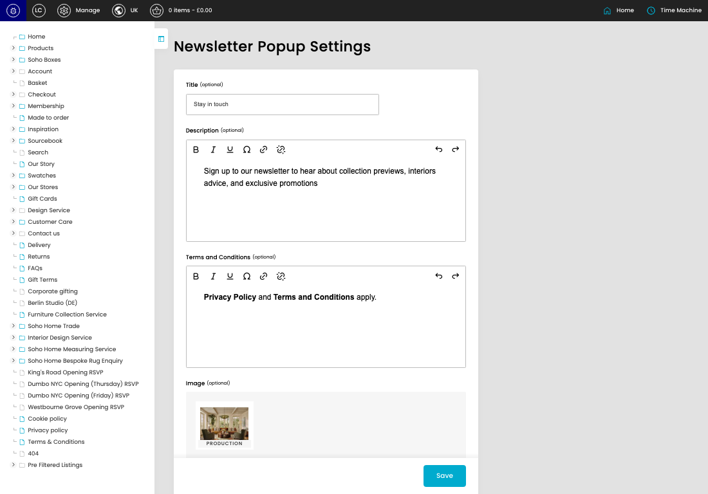
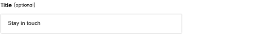

# Newsletter Popup

[Newsletter Popup overview](../../index.md) / Newsletter Popup

URL: [https://sohohome.com/cp/newsletter-popup-admin](https://sohohome.com/cp/newsletter-popup-admin)

This page covers Newsletter Popup.

*Newsletter Popup page overview*

## Using This Page

1. Open a Newsletter Popup entry from the listing, or select Create new.
2. Complete the labelled settings for the entry.
3. Select Save to apply the changes.

## What You Can Do

### Create a new entry

Select Create new to add a Newsletter Popup entry, then complete the labelled settings and save.

### Edit an existing entry

Open an existing Newsletter Popup entry to review or update its settings.

- Save applies the changes.

## Key Settings

The sections below highlight the settings people are most likely to change.

### Newsletter Popup

#### Title (optional)

*Title (optional) setting*

Enter the Title (optional).

**Effect:** Updates Title (optional).

**Notes:** optional

#### Description (optional)

*Description (optional) setting*

Enter the Description (optional) content.

**Effect:** Updates Description (optional).

#### Terms and Conditions (optional)

*Terms and Conditions (optional) setting*

Enter the Terms and Conditions (optional) content.

**Effect:** Updates Terms and Conditions (optional).

## Available Actions

- Upload Files
- Save
