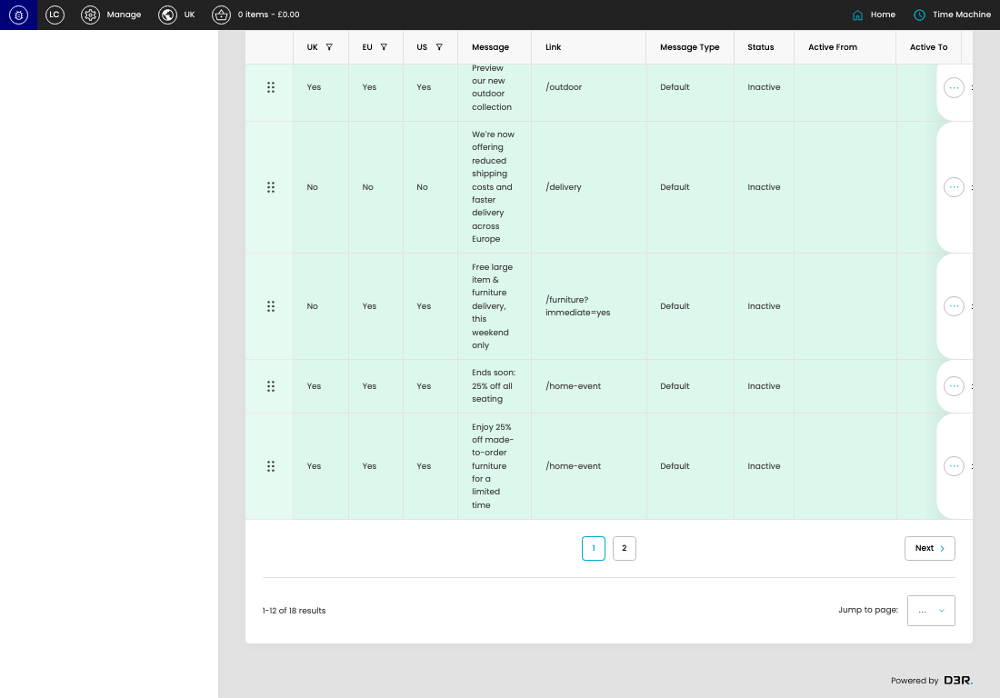

# Benefit Bar Settings

[Benefit Bar Settings overview](../../index.md) / Benefit Bar Settings listing

URL: [https://sohohome.com/cp/notice-admin](https://sohohome.com/cp/notice-admin)

This page covers Benefit Bar Settings.

*Benefit Bar Settings page overview*

## Using This Page

1. Open the Benefit Bar Settings page from the relevant navigation area or direct URL.
2. Use the listing to review existing Benefit Bar Setting entries.
3. Use the available create or edit actions to manage individual entries.

## What You Can Do

### Review existing entries

Use the listing to search, filter, and review existing Benefit Bar Setting entries.

- Column: UK
- Column: EU
- Column: US
- Column: Message
- Column: Link
- Column: Message Type
- Column: Status
- Column: Active From
- Column: Active To
- Column: Trade Customer Inclusions
- Column: Trade Customer Exclusions
- Column: Excluded Type

### Create a new entry

Select Create new to add a Benefit Bar Setting entry, then complete the labelled settings and save.

### Edit an existing entry

Open an existing Benefit Bar Setting entry to review or update its settings.

## Key Settings

The sections below highlight the settings people are most likely to change.

### Benefit Bar Settings

#### select

*select setting*

Choose the select from the available options.

**Effect:** Updates select.

**Options:** …, 1, 2

## Available Actions

- Default
- Membership
- Create new
- View Expired Content
- Search
- Add filter
- Sort by Default
- Edit columns
- 2
- Next
