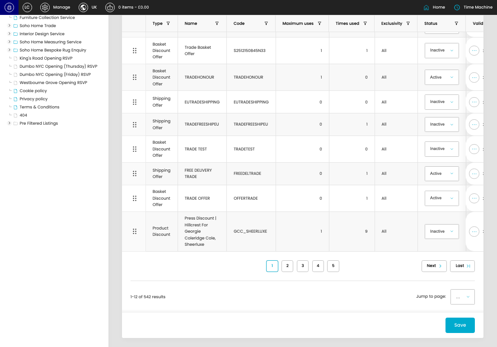
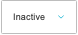
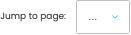

# Offers

[Offers overview](../../index.md) / Offers listing

URL: [https://sohohome.com/cp/offers-admin](https://sohohome.com/cp/offers-admin)

This page covers Offers.

*Offers page overview*

## Using This Page

1. Open the Offers page from the relevant navigation area or direct URL.
2. Use the listing to review existing Offer entries.
3. Use the available create or edit actions to manage individual entries.

## What You Can Do

### Review existing entries

Use the listing to search, filter, and review existing Offer entries.

- Column: Type
- Column: Name
- Column: Code
- Column: Maximum uses
- Column: Times used
- Column: Exclusivity
- Column: Status
- Column: Valid Currencies
- Column: Membership Renewals only
- Column: Member only
- Column: Exclude members
- Column: Exclude Trade Tiers

### Create a new entry

Select Create new to add a Offer entry, then complete the labelled settings and save.

### Edit an existing entry

Open an existing Offer entry to review or update its settings.

- Save applies the changes.

## Key Settings

The sections below highlight the settings people are most likely to change.

### listing-offers_offer-form

#### Offer Status

*Offer Status setting*

Set the Offer Status value for each relevant row in this section.

**Effect:** Updates Offer Status.

**Options:** Active, Inactive

#### select

*select setting*

Choose the select from the available options.

**Effect:** Updates select.

**Options:** …, 1, 2, 3, 4, 5, 6, 7, 8, 9, 10, 11, and 18 more

## Available Actions

- Create new
- Export csv
- Search
- Add filter
- Sort by Default
- Edit columns
- 2
- 3
- 4
- 5
- Next
- Last
- Save
