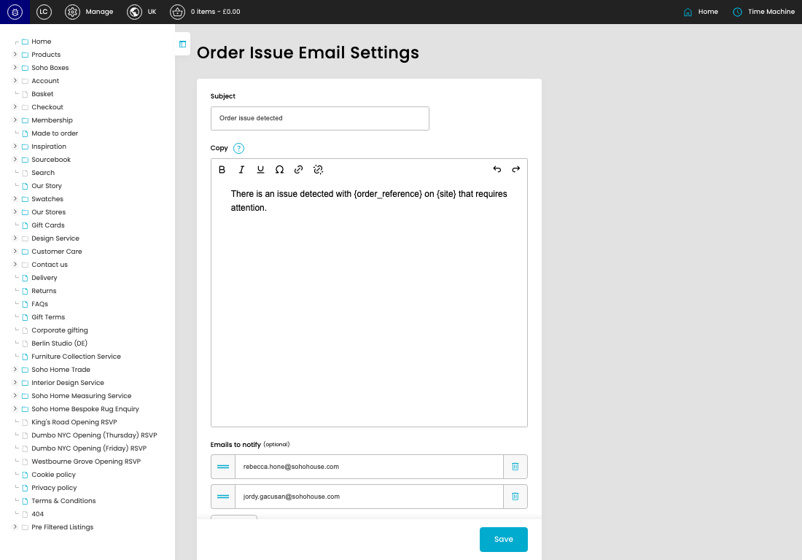
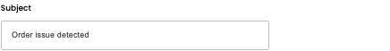
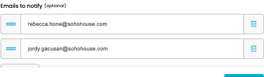

# Order Issue Email Settings

[Order Issue Email Settings overview](../../index.md) / Order Issue Email Settings

URL: [https://sohohome.com/cp/order-issue-email-settings-admin](https://sohohome.com/cp/order-issue-email-settings-admin)

Use this page to manage Order Issue Email Settings.

*Order Issue Email Settings page overview*

## Using This Page

1. Open a Order Issue Email Setting entry from the listing, or select Create new.
2. Complete the labelled settings for the entry.
3. Select Save to apply the changes.

## What You Can Do

### Create a new entry

Select Create new to add a Order Issue Email Setting entry, then complete the labelled settings and save.

### Edit an existing entry

Open an existing Order Issue Email Setting entry to review or update its settings.

- Save applies the changes.

## Key Settings

The sections below highlight the settings people are most likely to change.

### Order Issue Email Settings

#### Subject

*Subject setting*

Enter the Subject.

**Effect:** Updates Subject.

**Validation:** Required.

#### Copy

*Copy setting*

Enter the Copy content.

**Effect:** Updates Copy.

**Notes:** `{site}` and `{order_reference}` is available for dynamic copy replacement

#### setting_emails[0][]

*setting_emails[0][] setting*

Enter the setting_emails[0][].

**Effect:** Updates setting_emails[0][].

#### setting_emails[1][]

*setting_emails[1][] setting*

Enter the setting_emails[1][].

**Effect:** Updates setting_emails[1][].

## Available Actions

- Add new
- Save
