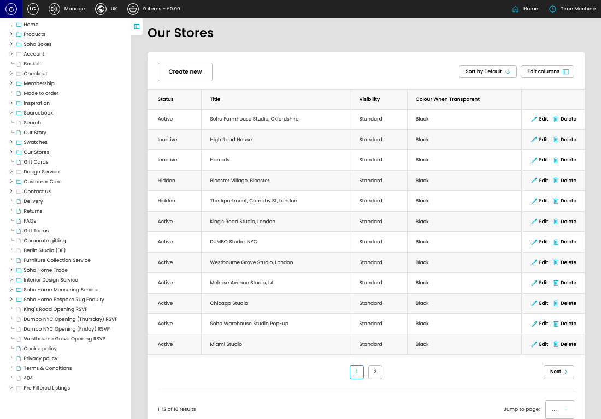

# Our Stores

[Our Stores overview](../../index.md) / Our Stores listing

URL: [https://sohohome.com/cp/our-stores-admin](https://sohohome.com/cp/our-stores-admin)

Use this page to manage Our Stores.

*Our Stores page overview*

## Using This Page

1. Open the Our Stores page from the relevant navigation area or direct URL.
2. Use the listing to review existing Our Store entries.
3. Use the available create or edit actions to manage individual entries.

## What You Can Do

### Review existing entries

Use the listing to search, filter, and review existing Our Store entries.

- Column: Status
- Column: Title
- Column: Visibility
- Column: Colour When Transparent

### Create a new entry

Select Create new to add a Our Store entry, then complete the labelled settings and save.

### Edit an existing entry

Open an existing Our Store entry to review or update its settings.

## Key Settings

The sections below highlight the settings people are most likely to change.

### Our Stores

#### select

*select setting*

Choose the select from the available options.

**Effect:** Updates select.

**Options:** …, 1, 2

## Available Actions

- Create new
- Sort by Default
- Edit columns
- 2
- Next
