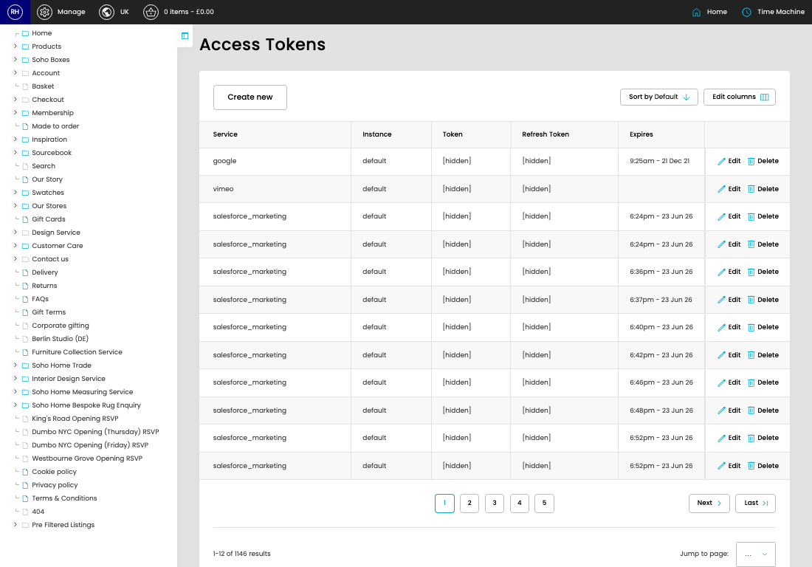

# Access Tokens

[Home](../../index.md) / Access Tokens

URL: [https://sohohome.com/cp/access-tokens](https://sohohome.com/cp/access-tokens)

Access Tokens store integration access and refresh tokens for services that need authenticated API calls.

*Access Tokens page overview*

## Related Pages

- [Edit Access Token](../002-cp-access-tokens-edit-35373-f9f6d2ce/README.md): Open an existing access token when you need to check the setup or make a change.

## How It Works

- Each record belongs to a service and instance, which lets separate integrations keep their own credentials.
- Expiry dates help identify tokens that may need to be refreshed before an integration stops working.
- The key fields are Service, Instance, Token, Refresh Token, and Expires, which explain what the record is for and how it can be used.

## Using This Page

1. Open Access Tokens from the CP navigation.
2. Scan the fields in the table to find the access token you need.

## What You Can Do

### Review access tokens

Review the visible fields to check what already exists.

- Field: Service
- Field: Instance
- Field: Token
- Field: Refresh Token
- Field: Expires

Example rows:

| Service | Instance | Token | Refresh Token | Expires |
| --- | --- | --- | --- | --- |
| google | default | [hidden] | [hidden] | 9:25am - 21 Dec 21 |
| vimeo | default | [hidden] |  |  |
| salesforce_marketing | default | [hidden] |  | 6:24pm - 23 Jun 26 |
