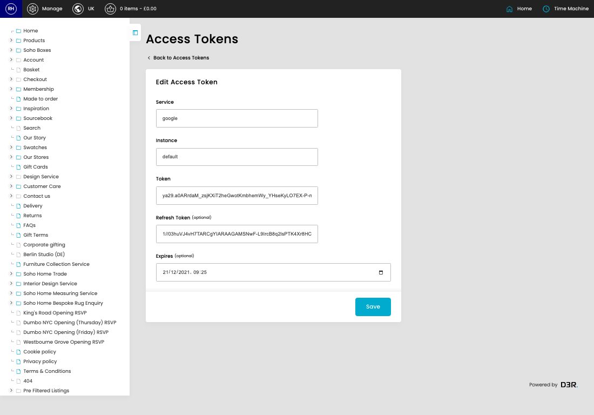
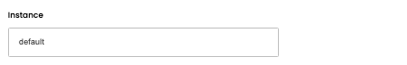
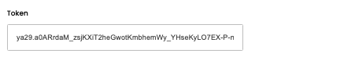
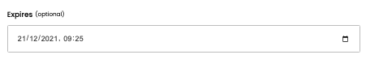

# Access Tokens

[Home](../../index.md) / [Access Tokens](../001-cp-access-tokens-c852f881/README.md) / Edit Access Token

URL: [https://sohohome.com/cp/access-tokens/edit/:id](https://sohohome.com/cp/access-tokens/edit/:id)

Access Tokens store integration access and refresh tokens for services that need authenticated API calls.

*Access Tokens page overview*

## Related Pages

- [Access Tokens](../001-cp-access-tokens-c852f881/README.md): Review the visible fields to check what already exists.

## How It Works

- Each record belongs to a service and instance, which lets separate integrations keep their own credentials.
- Expiry dates help identify tokens that may need to be refreshed before an integration stops working.
- The key fields are Service, Instance, Token, Refresh Token, and Expires, which explain what the record is for and how it can be used.

## Using This Page

1. Open the existing access token you need to change.
2. Work through the fields that are relevant to the change.
3. Save once the details are correct.

## What You Can Do

### Edit an existing access token

Open an existing access token when you need to check the setup or make a change.

- Save once the details are correct.

## Key Settings

### Edit Access Token

#### Service

*Service setting*

Add the service.

**Validation:** Required.

#### Instance

*Instance setting*

Add the instance.

**Validation:** Required.

#### Token

*Token setting*

Add the token.

**Validation:** Required.

#### Refresh Token (optional)

*Refresh Token (optional) setting*

Add the refresh token (optional).

**Notes:** optional

#### Expires (optional)

*Expires (optional) setting*

Add the expires (optional).

**Notes:** optional
