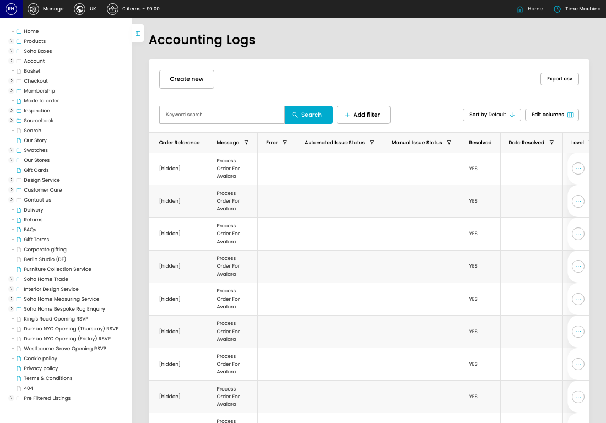

# Accounting Logs (Sage & Avalara)

[Home](../../index.md) / Accounting Logs (Sage & Avalara)

URL: [https://sohohome.com/cp/accounting-logs](https://sohohome.com/cp/accounting-logs)

Accounting Logs (Sage & Avalara) record Sage and Avalara accounting activity so integration issues and resolution status can be reviewed.

*Accounting Logs (Sage & Avalara) page overview*

## Related Pages

- [Edit Accounting Logs (Sage & Avalara)](../004-cp-accounting-logs-edit-id-e9d3b5ea/README.md): Open an existing accounting logs (sage & avalara) when you need to check the setup or make a change.

## How It Works

- The key fields are Order Reference, Log, Order, Entity, and Message, which explain what the record is for and how it can be used.

## Using This Page

1. Search or filter until you find the accounting logs (sage & avalara) you need.

## What You Can Do

### Review accounting logs (sage & avalara)

Search or filter the visible fields to find the accounting logs (sage & avalara) you need.

- Visible fields include Order Reference, Message, Error, Automated Issue Status, Manual Issue Status, Resolved, Date Resolved, and Level.

Example rows:

| Order Reference | Message | Error | Automated Issue Status | Manual Issue Status | Resolved |
| --- | --- | --- | --- | --- | --- |
| [hidden] | Process Order For Avalara |  |  |  | YES |
| [hidden] | Process Order For Avalara |  |  |  | YES |
| [hidden] | Process Order For Avalara |  |  |  | YES |
