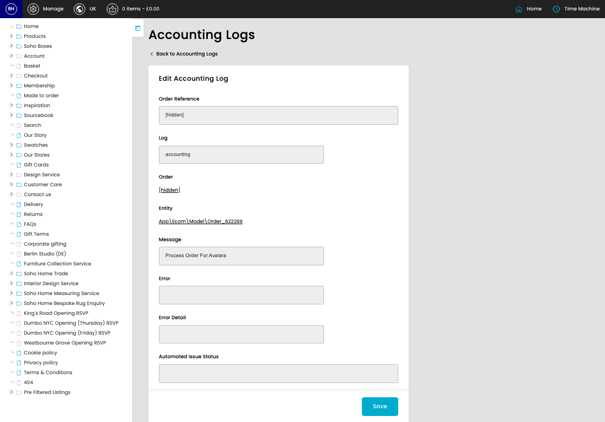

# Accounting Logs (Sage & Avalara)

[Home](../../index.md) / [Accounting Logs (Sage & Avalara)](../003-cp-accounting-logs-140ba15d/README.md) / Edit Accounting Logs (Sage & Avalara)

URL: [https://sohohome.com/cp/accounting-logs/edit/:id](https://sohohome.com/cp/accounting-logs/edit/:id)

Accounting Logs (Sage & Avalara) record Sage and Avalara accounting activity so integration issues and resolution status can be reviewed.

*Accounting Logs (Sage & Avalara) page overview*

## Related Pages

- [Accounting Logs (Sage & Avalara)](../003-cp-accounting-logs-140ba15d/README.md): Search or filter the visible fields to find the accounting logs (sage & avalara) you need.

## How It Works

- The key fields are Order Reference, Log, Order, Entity, and Message, which explain what the record is for and how it can be used.

## Using This Page

1. Open the existing accounting logs (sage & avalara) you need to change.
2. Work through the fields that are relevant to the change.
3. Save once the details are correct.

## What You Can Do

### Edit an existing accounting logs (sage & avalara)

Open an existing accounting logs (sage & avalara) when you need to check the setup or make a change.

- Save once the details are correct.

## Key Settings

### Edit Accounting Log

#### Manual Issue Status

*Manual Issue Status setting*

Choose the option that matches this manual issue status.

**Options:** Resolved, Unresolved, n_a
