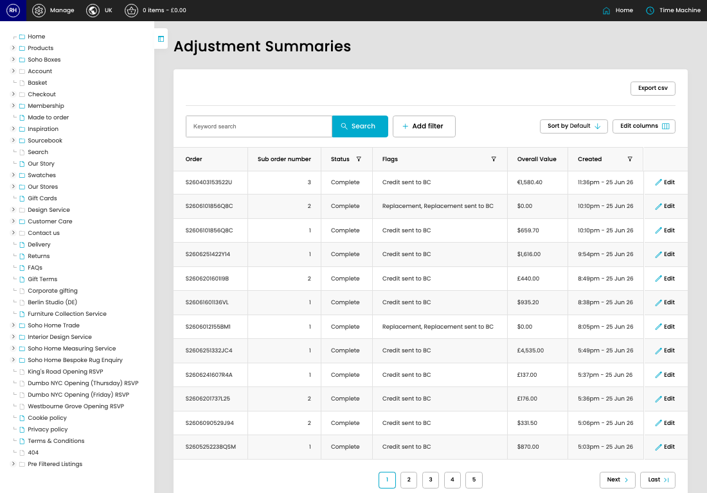

# Adjustments

[Home](../../index.md) / Adjustments

URL: [https://sohohome.com/cp/adjustments-summary-admin](https://sohohome.com/cp/adjustments-summary-admin)

Adjustments summarise order adjustments and related finance-system transfer activity for review.

*Adjustments page overview*

## Related Pages

- [Edit Adjustment](../006-cp-adjustments-summary-admin-edit-91213-5ab58d27/README.md): Open an existing adjustment when you need to check the setup or make a change.

## How It Works

- Makes sure the transfer property is set appropriately.
- The key fields are Order, Sub order number, Status, Flags, and Overall Value, which explain what the record is for and how it can be used.

## Using This Page

1. Open Adjustments from the CP navigation.
2. Search or filter until you find the adjustment you need.

## What You Can Do

### Review adjustments

Search or filter the visible fields to find the adjustment you need.

- Field: Order
- Field: Sub order number
- Field: Status
- Field: Flags
- Field: Overall Value
- Field: Created

Example rows:

| Order | Sub order number | Status | Flags | Overall Value | Created |
| --- | --- | --- | --- | --- | --- |
| S260403153522U | 3 | Complete | Credit sent to BC | €1,580.40 | 11:36pm - 25 Jun 26 |
| S2606101856Q8C | 2 | Complete | Replacement, Replacement sent to BC | $0.00 | 10:10pm - 25 Jun 26 |
| S2606101856Q8C | 1 | Complete | Credit sent to BC | $659.70 | 10:10pm - 25 Jun 26 |
