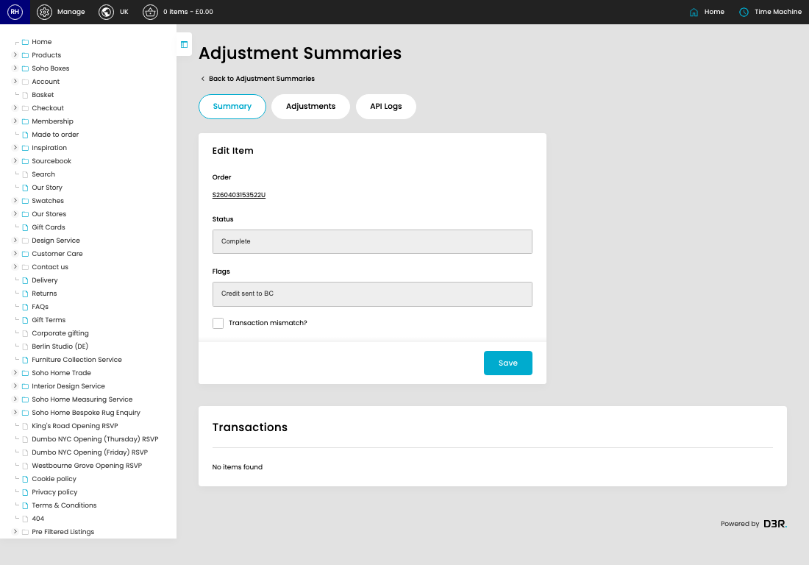

# Adjustments

[Home](../../index.md) / Edit Adjustment

URL: [https://sohohome.com/cp/adjustments-summary-admin/edit/91213](https://sohohome.com/cp/adjustments-summary-admin/edit/91213)

Adjustments summarise order adjustments and related finance-system transfer activity for review.

*Adjustments page overview*

## Related Pages

- [Adjustments](../005-cp-adjustments-summary-admin-6754dd0f/README.md): Search or filter the visible fields to find the adjustment you need.

## How It Works

- Makes sure the transfer property is set appropriately.
- The key fields are Order, Sub order number, Status, Flags, and Overall Value, which explain what the record is for and how it can be used.

## Using This Page

1. Open the existing adjustment you need to change.
2. Work through the fields that are relevant to the change.
3. Save once the details are correct.

## What You Can Do

### Edit an existing adjustment

Open an existing adjustment when you need to check the setup or make a change.

- Save once the details are correct.

## Key Settings

### Edit Item

#### Transaction mismatch?

*Transaction mismatch? setting*

Turn this on when transaction mismatch? should apply. Leave it off when it should not.

## Available Actions

- Summary
- Adjustments
- API Logs
