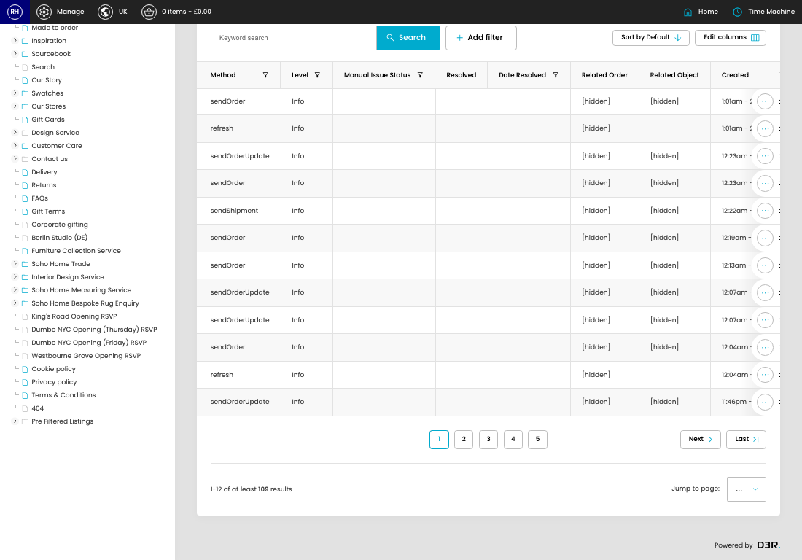

# Outbound API Logs

[Home](../../index.md) / Outbound API Logs

URL: [https://sohohome.com/cp/ais-client-outbound-logs](https://sohohome.com/cp/ais-client-outbound-logs)

Outbound API Logs record outbound AIS API requests so sent data, failures, and debug activity can be reviewed.

*Outbound API Logs page overview*

## Related Pages

- [Edit Outbound API Log](../008-cp-ais-client-outbound-logs-edit-id-2dd14f8c/README.md): Open an existing outbound API log when you need to check the setup or make a change.

## Using This Page

1. Search or filter until you find the outbound API log you need.

## What You Can Do

### Review outbound API logs

Search or filter the visible fields to find the outbound API log you need.

- Visible fields include Method, Level, Manual Issue Status, Resolved, Date Resolved, Related Order, Related Object, and Created.

Example rows:

| Method | Level | Manual Issue Status | Resolved | Date Resolved | Related Order |
| --- | --- | --- | --- | --- | --- |
| sendOrder | Info |  |  |  | [hidden] |
| refresh | Info |  |  |  |  |
| sendOrderUpdate | Info |  |  |  | [hidden] |
