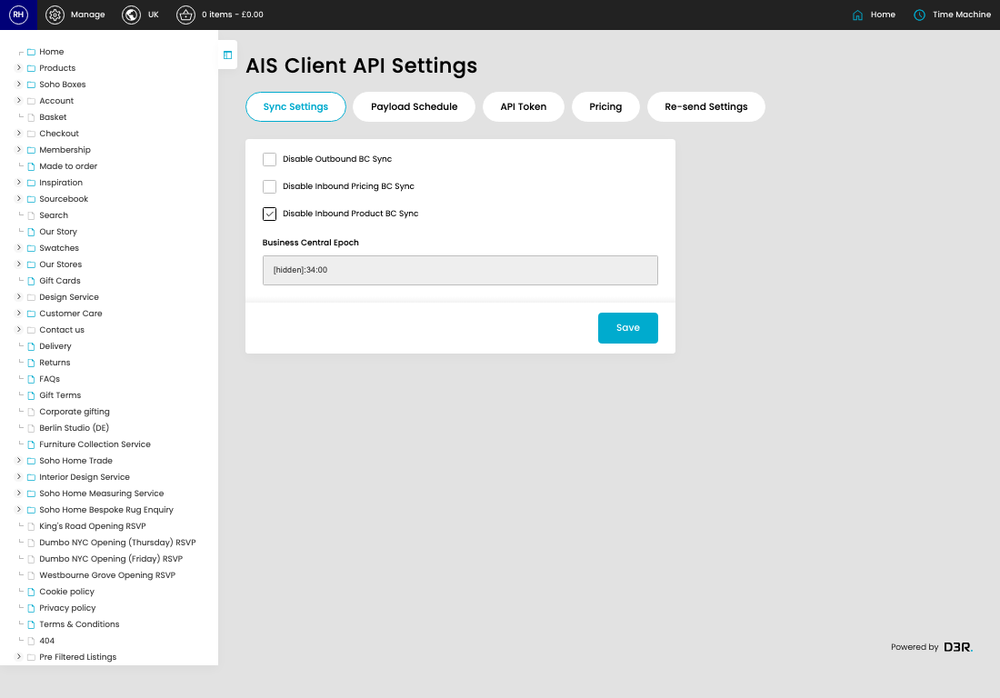

# Client API Settings

[Home](../../index.md) / Client API Settings

URL: [https://sohohome.com/cp/ais-client-settings](https://sohohome.com/cp/ais-client-settings)

Client API Settings control AIS client sync behaviour, including Business Central sync and scheduled pricing update settings.

*Client API Settings page overview*

## How It Works

- The key fields are Send Shipment Transfer (mins), Disable Scheduled Pricing Updates, Scheduled Pricing Update Frequency, Last Scheduled Pricing Update, and Scheduled Pricing Report Recipients, which explain what the record is for and how it can be used.

## Using This Page

1. Open the Client API Settings screen.
2. Work through the fields that are relevant to the change, then save once the details are correct.

## What You Can Do

### Update settings

Use the fields on this screen to make the change, then save once the values are correct.

## Key Settings

### AIS Client API Settings

#### Disable Outbound BC Sync

Turn this on when the answer should be yes. Leave it off when it should not apply.

#### Disable Inbound Pricing BC Sync

Turn this on when the answer should be yes. Leave it off when it should not apply.

#### Disable Inbound Product BC Sync

Turn this on when the answer should be yes. Leave it off when it should not apply.

## Page Sections

- Sync Settings
- Payload Schedule
- API Token
- Pricing
- Re-send Settings
