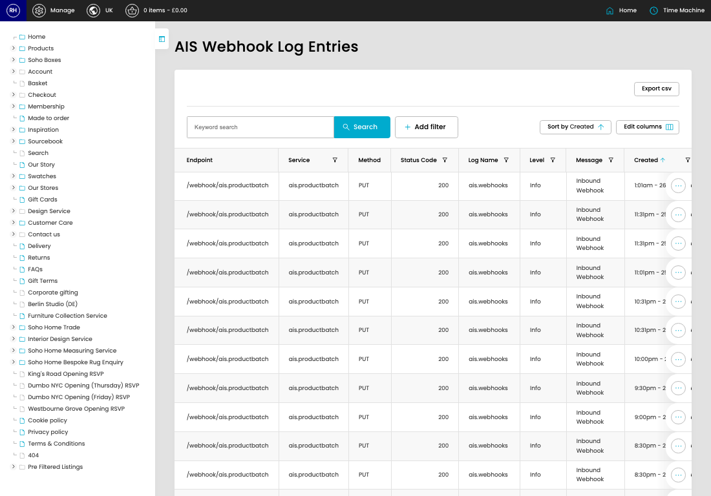

# Webhook Logs

[Home](../../index.md) / Webhook Logs

URL: [https://sohohome.com/cp/ais-webhooks-logs-admin](https://sohohome.com/cp/ais-webhooks-logs-admin)

Webhook Logs record incoming AIS webhook activity so failed or processed requests can be reviewed later.

*Webhook Logs page overview*

## Related Pages

- [View Webhook Log](../012-cp-ais-webhooks-logs-admin-view-id-dacc22d3/README.md): Open an existing webhook log when you need to check the full details.

## How It Works

- The key fields are Endpoint, Service, Method, Request, and Status Code, which explain what the record is for and how it can be used.

## Using This Page

1. Search or filter until you find the webhook log you need.

## What You Can Do

### Review webhook logs

Search or filter the visible fields to find the webhook log you need.

- Visible fields include Endpoint, Service, Method, Status Code, Log Name, Level, Message, and Created.

Example rows:

| Endpoint | Service | Method | Status Code | Log Name | Level |
| --- | --- | --- | --- | --- | --- |
| /webhook/ais.productbatch | ais.productbatch | PUT | 200 | ais.webhooks | Info |
| /webhook/ais.productbatch | ais.productbatch | PUT | 200 | ais.webhooks | Info |
| /webhook/ais.productbatch | ais.productbatch | PUT | 200 | ais.webhooks | Info |
