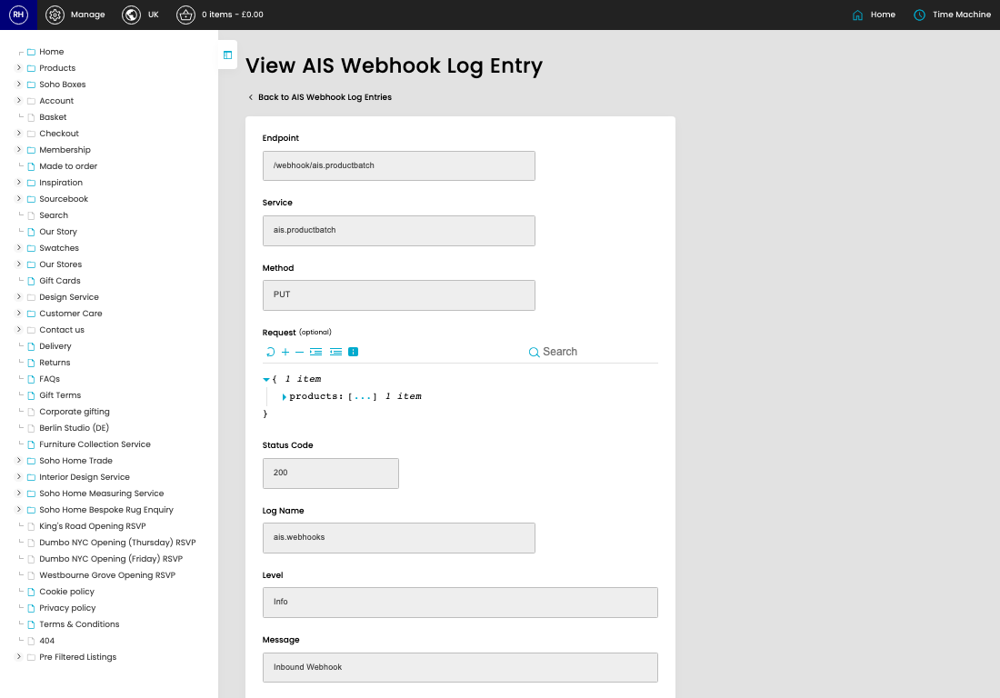

# Webhook Logs

[Home](../../index.md) / [Webhook Logs](../011-cp-ais-webhooks-logs-admin-f874d579/README.md) / View Webhook Log

URL: [https://sohohome.com/cp/ais-webhooks-logs-admin/view/:id](https://sohohome.com/cp/ais-webhooks-logs-admin/view/:id)

Webhook Logs record incoming AIS webhook activity so failed or processed requests can be reviewed later.

*Webhook Logs page overview*

## Related Pages

- [Webhook Logs](../011-cp-ais-webhooks-logs-admin-f874d579/README.md): Search or filter the visible fields to find the webhook log you need.

## How It Works

- The key fields are Endpoint, Service, Method, Request, and Status Code, which explain what the record is for and how it can be used.

## Using This Page

1. Open the existing webhook log you need to review.
2. Use the visible fields to check the details.

## What You Can Do

### Review an existing webhook log

Open an existing webhook log when you need to check the full details.
