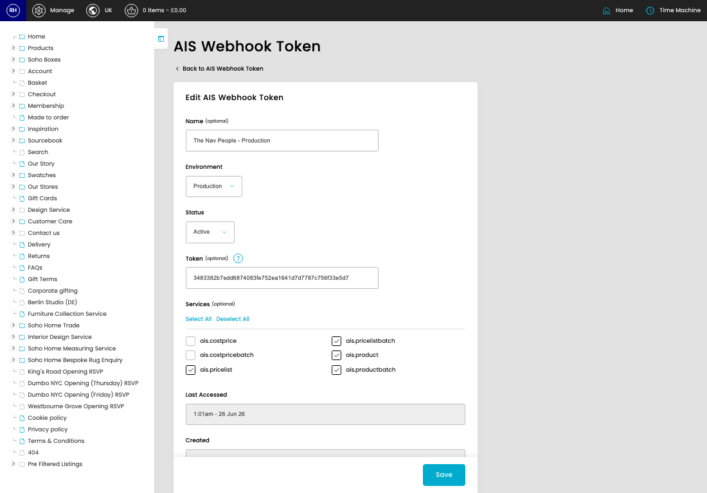
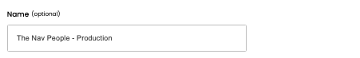
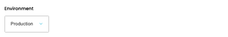
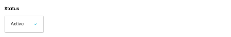
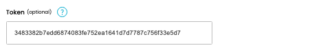

# Webhook Tokens

[Home](../../index.md) / [Webhook Tokens](../013-cp-ais-webhooks-tokens-admin-a0f873de/README.md) / Edit Webhook Token

URL: [https://sohohome.com/cp/ais-webhooks-tokens-admin/edit/:id](https://sohohome.com/cp/ais-webhooks-tokens-admin/edit/:id)

Webhook Tokens are bearer tokens used to authorise incoming AIS webhook requests before the site accepts the data they send.

*Webhook Tokens page overview*

## Related Pages

- [Webhook Tokens](../013-cp-ais-webhooks-tokens-admin-a0f873de/README.md): Search or filter the visible fields to find the webhook token you need.

## How It Works

- Incoming webhook calls must send the token as a bearer token. The request is rejected unless the token is active and belongs to the current environment.
- Each token can be limited to selected webhook services, so access can be granted for only the AIS feeds that need it.
- Refreshing a token generates a replacement value. Any external system using the old value must be updated afterwards.
- Revoking a token marks it inactive, which stops future webhook requests from authenticating with it.
- Last Accessed is updated after a successful request, which helps confirm whether a webhook integration is still using the token.

## Using This Page

1. Open the existing webhook token you need to change.
2. Work through the fields that are relevant to the change.
3. Save once the details are correct.

## What You Can Do

### Edit an existing webhook token

Open an existing webhook token when you need to check the setup or make a change.

- Save once the details are correct.

## Key Settings

### Edit AIS Webhook Token

#### Name (optional)

*Name (optional) setting*

Add the name (optional).

**Notes:** optional

#### Environment

*Environment setting*

Choose the option that matches this environment.

**Options:** Production, Staging, Local

#### Status

*Status setting*

Choose the option that matches this status.

**Options:** Active, Inactive

#### Token (optional)

*Token (optional) setting*

Add the token (optional).

**Notes:** Leave blank to generate a new token

#### ais.costprice

Turn this on when ais.costprice should apply. Leave it off when it should not.

#### ais.costpricebatch

Turn this on when ais.costpricebatch should apply. Leave it off when it should not.

#### ais.pricelist

Turn this on when ais.pricelist should apply. Leave it off when it should not.

#### ais.pricelistbatch

Turn this on when ais.pricelistbatch should apply. Leave it off when it should not.

#### ais.product

Turn this on when ais.product should apply. Leave it off when it should not.

#### ais.productbatch

Turn this on when ais.productbatch should apply. Leave it off when it should not.
