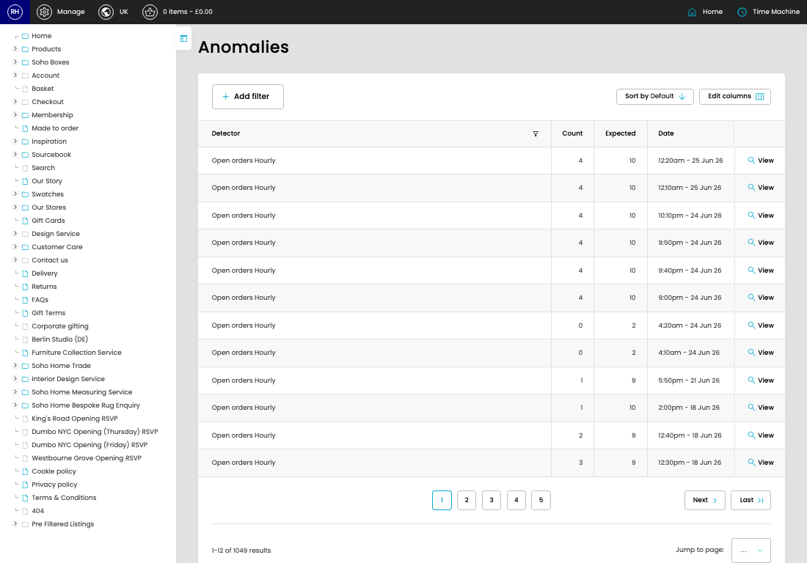

# Anomalies

[Home](../../index.md) / Anomalies

URL: [https://sohohome.com/cp/anomaly-anomalies](https://sohohome.com/cp/anomaly-anomalies)

Anomalies list detected anomalies where recorded counts differ from the expected range.

*Anomalies page overview*

## Related Pages

- [View Anomaly](../016-cp-anomaly-anomalies-view-1049-b964294b/README.md): Open an existing anomaly when you need to check the full details.

## How It Works

- The key fields are Detector, Count, Expected, and Date, which explain what the record is for and how it can be used.

## Using This Page

1. Open Anomalies from the CP navigation.
2. Scan the fields in the table to find the anomaly you need.

## What You Can Do

### Review anomalies

Review the visible fields to check what already exists.

- Field: Detector
- Field: Count
- Field: Expected
- Field: Date

Example rows:

| Detector | Count | Expected | Date |
| --- | --- | --- | --- |
| Open orders Hourly | 4 | 10 | 12:20am - 25 Jun 26 |
| Open orders Hourly | 4 | 10 | 12:10am - 25 Jun 26 |
| Open orders Hourly | 4 | 10 | 10:10pm - 24 Jun 26 |
