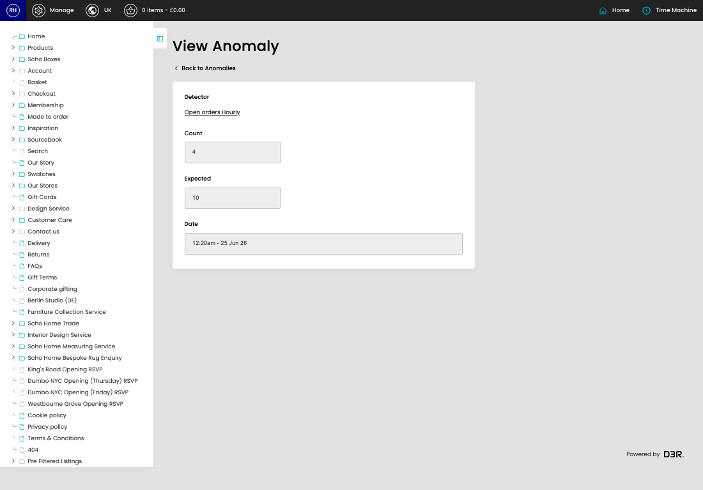

# Anomalies

[Home](../../index.md) / View Anomaly

URL: [https://sohohome.com/cp/anomaly-anomalies/view/1049](https://sohohome.com/cp/anomaly-anomalies/view/1049)

Anomalies list detected anomalies where recorded counts differ from the expected range.

*Anomalies page overview*

## Related Pages

- [Anomalies](../015-cp-anomaly-anomalies-cc7972c6/README.md): Review the visible fields to check what already exists.

## How It Works

- The key fields are Detector, Count, Expected, and Date, which explain what the record is for and how it can be used.

## Using This Page

1. Open the existing anomaly you need to review.
2. Use the visible fields to check the details.

## What You Can Do

### Review an existing anomaly

Open an existing anomaly when you need to check the full details.
