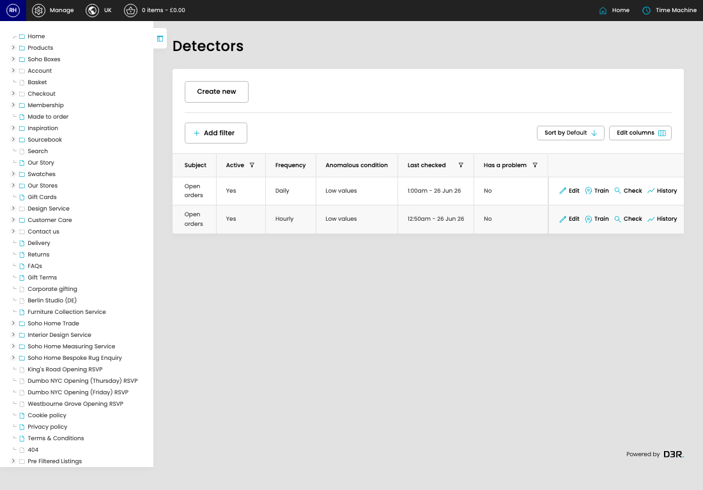

# Anomaly Detectors

[Home](../../index.md) / Anomaly Detectors

URL: [https://sohohome.com/cp/anomaly-detectors](https://sohohome.com/cp/anomaly-detectors)

Anomaly Detectors define the checks, schedule, thresholds, and alerts used to detect unusual data patterns.

*Anomaly Detectors page overview*

## Related Pages

- [Edit Anomaly Detector](../018-cp-anomaly-detectors-edit-1-08de309b/README.md): Review what already exists, then open a row when a change is needed.

## How It Works

- The key fields are Subject, Active, Frequency, Anomalous condition, and Offset, which explain what the record is for and how it can be used.

## Using This Page

1. Open Anomaly Detectors from the CP navigation.
2. Scan the fields in the table to find the anomaly detector you need.

## What You Can Do

### Review anomaly detectors

Review the visible fields to check what already exists.

- Field: Subject
- Field: Active
- Field: Frequency
- Field: Anomalous condition
- Field: Last checked
- Field: Has a problem
- Field: Problem began
- Field: Problem resolved

Example rows:

| Subject | Active | Frequency | Anomalous condition | Last checked | Has a problem |
| --- | --- | --- | --- | --- | --- |
| Open orders | Yes | Daily | Low values | 1:00am - 26 Jun 26 | No |
| Open orders | Yes | Hourly | Low values | 12:50am - 26 Jun 26 | No |
