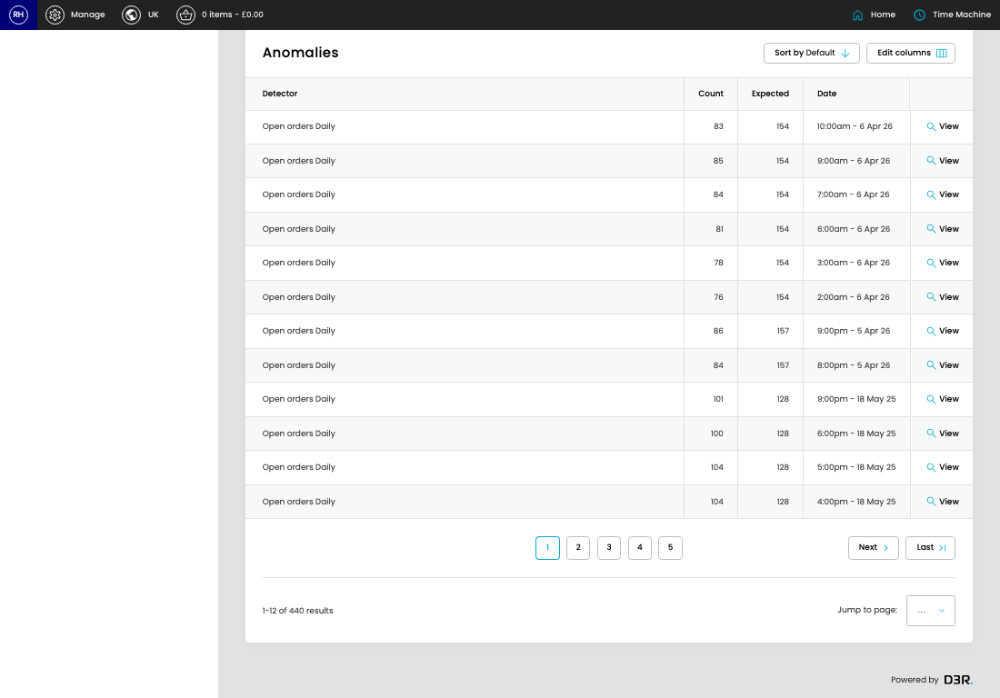
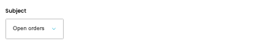
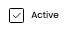
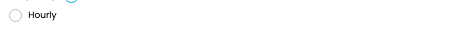
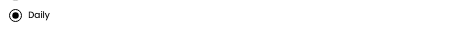
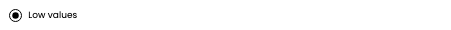
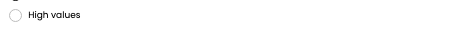
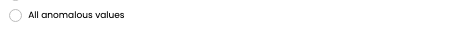
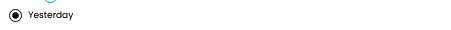

# Anomaly Detectors

[Home](../../index.md) / Edit Anomaly Detector

URL: [https://sohohome.com/cp/anomaly-detectors/edit/1](https://sohohome.com/cp/anomaly-detectors/edit/1)

Anomaly Detectors define the checks, schedule, thresholds, and alerts used to detect unusual data patterns.

*Anomaly Detectors page overview*

## Related Pages

- [Anomaly Detectors](../017-cp-anomaly-detectors-40a56808/README.md): Review the visible fields to check what already exists.

## How It Works

- The key fields are Subject, Active, Frequency, Anomalous condition, and Offset, which explain what the record is for and how it can be used.

## Using This Page

1. Open Anomaly Detectors from the CP navigation.
2. Scan the fields in the table to find the anomaly detector you need.
3. Open a row when you need to check the details or make a change.

## What You Can Do

### Review anomaly detectors

Review what already exists, then open a row when a change is needed.

- Field: Detector
- Field: Count
- Field: Expected
- Field: Date

Example rows:

| Detector | Count | Expected | Date |
| --- | --- | --- | --- |
| Open orders Daily | 83 | 154 | 10:00am - 6 Apr 26 |
| Open orders Daily | 85 | 154 | 9:00am - 6 Apr 26 |
| Open orders Daily | 84 | 154 | 7:00am - 6 Apr 26 |

### Edit an existing anomaly detector

Open an existing anomaly detector when you need to check the setup or make a change.

- Save once the details are correct.

## Key Settings

The sections below highlight the settings people are most likely to change.

### Edit Detector

#### Subject

*Subject setting*

Choose the option that matches this subject.

**Options:** Open orders

#### Active

*Active setting*

Turn this on when active should apply. Leave it off when it should not.

#### Hourly

*Hourly setting*

Choose the option that matches this hourly.

**Notes:** The size of buckets we divide the counts into

#### Daily

*Daily setting*

Choose the option that matches this daily.

**Notes:** The size of buckets we divide the counts into

#### Low values

*Low values setting*

Choose the option that matches this low values.

#### High values

*High values setting*

Choose the option that matches this high values.

#### All anomalous values

*All anomalous values setting*

Choose the option that matches this all anomalous values.

#### Yesterday

*Yesterday setting*

Choose the option that matches this yesterday.

**Notes:** How long ago is the latest training point

#### Last week

Choose the option that matches this last week.

**Notes:** How long ago is the latest training point

#### Last month

Choose the option that matches this last month.

**Notes:** How long ago is the latest training point

#### 30 days

Choose the option that matches this 30 days.

**Notes:** The timeframe over which we extract training data

#### 90 days

Choose the option that matches this 90 days.

**Notes:** The timeframe over which we extract training data

#### 180 days

Choose the option that matches this 180 days.

**Notes:** The timeframe over which we extract training data

#### detector_emails[]

Add the detector_emails[].

#### detector_emails[]

Add the detector_emails[].

#### detector_emails[]

Add the detector_emails[].

#### Has a problem

Turn this on when the answer should be yes. Leave it off when it should not apply.

## Available Actions

- Add new
