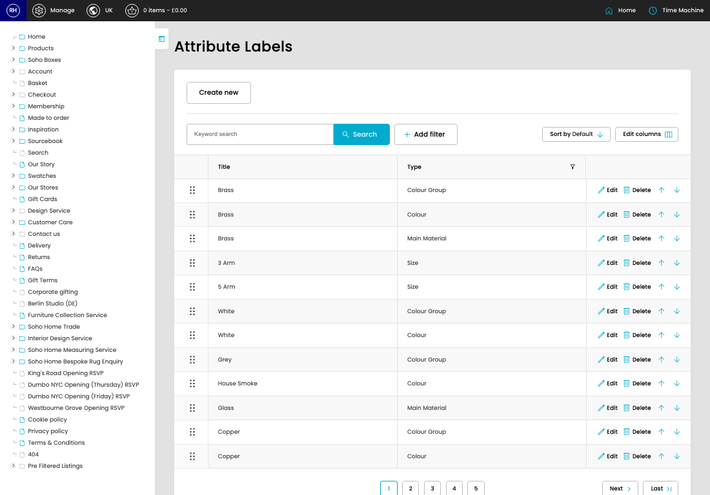

# Attribute Labels

[Home](../../index.md) / Attribute Labels

URL: [https://sohohome.com/cp/attribute-labels-admin](https://sohohome.com/cp/attribute-labels-admin)

List the attribute labels

*Attribute Labels page overview*

## Related Pages

- [Edit Attribute Label](../020-cp-attribute-labels-admin-edit-1-a43265f5/README.md): Open an existing attribute label when you need to check the setup or make a change.

## How It Works

- After this has been updated.
- Refresh Action.
- The key fields are Url Name, which explain what the record is for and how it can be used.

## Using This Page

1. Open Attribute Labels from the CP navigation.
2. Search or filter until you find the attribute label you need.

## What You Can Do

### Review attribute labels

Search or filter the visible fields to find the attribute label you need.

- Field: Title
- Field: Type

Example rows:

| Title | Type |
| --- | --- |
|  | Brass |
|  | Brass |
|  | Brass |
