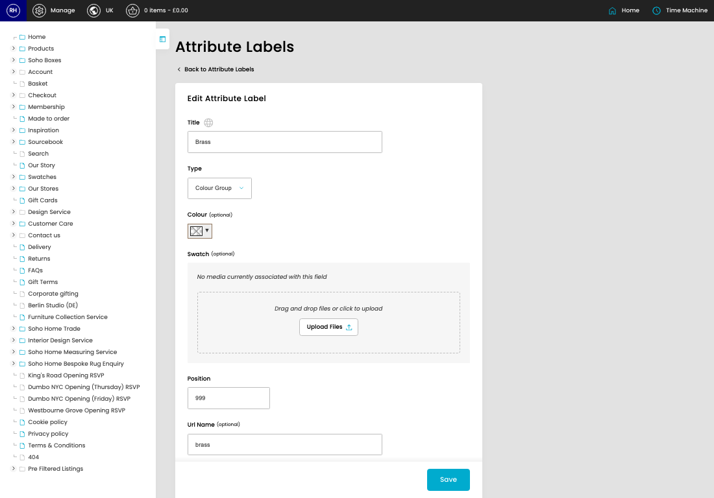
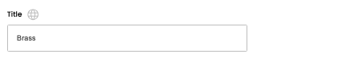
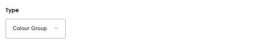
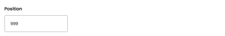
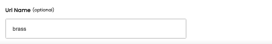

# Attribute Labels

[Home](../../index.md) / Edit Attribute Label

URL: [https://sohohome.com/cp/attribute-labels-admin/edit/1](https://sohohome.com/cp/attribute-labels-admin/edit/1)

List the attribute labels

*Attribute Labels page overview*

## Related Pages

- [Attribute Labels](../019-cp-attribute-labels-admin-23ba06b4/README.md): Search or filter the visible fields to find the attribute label you need.

## How It Works

- After this has been updated.
- Refresh Action.
- The key fields are Url Name, which explain what the record is for and how it can be used.

## Using This Page

1. Open the existing attribute label you need to change.
2. Work through the fields that are relevant to the change.
3. Save once the details are correct.

## What You Can Do

### Edit an existing attribute label

Open an existing attribute label when you need to check the setup or make a change.

- Save once the details are correct.

## Key Settings

### Edit Attribute Label

#### Title

*Title setting*

Add the title.

**Validation:** Required.

#### Type

*Type setting*

Choose the option that matches this type.

**Options:** Colour Group, Colour, Main Fabric, Main Material, Shape, Size, Trim, Wood Finish, Swatch

#### Position

*Position setting*

Add the position.

**Validation:** Required.

#### Url Name (optional)

*Url Name (optional) setting*

Add the url name (optional).

**Notes:** optional

## Available Actions

- Upload Files
