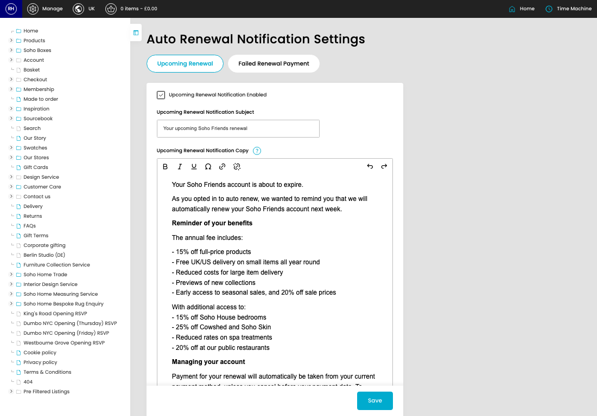
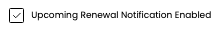
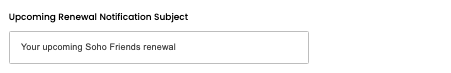
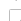

# Auto Renewal Notification Settings

[Home](../../index.md) / Auto Renewal Notification Settings

URL: [https://sohohome.com/cp/auto-renewal-notification-settings-admin](https://sohohome.com/cp/auto-renewal-notification-settings-admin)

Auto Renewal Notification Settings covers the admin screen used to review and maintain auto renewal notification settings.

*Auto Renewal Notification Settings page overview*

## How It Works

- Update the crystallised membership fields from DigitalHouse or our applications model.
- Sync a customer's details down from digital house.
- The key fields are Upcoming Renewal Notification Enabled, Upcoming Renewal Notification Subject, Upcoming Renewal Notification Copy, Failed Renewal Payment Subject, and Failed Renewal Payment Copy, which explain what the record is for and how it can be used.

## Using This Page

1. Open the Auto Renewal Notification Settings screen.
2. Work through the fields that are relevant to the change, then save once the details are correct.

## What You Can Do

### Update settings

Use the fields on this screen to make the change, then save once the values are correct.

## Key Settings

### Auto Renewal Notification Settings

#### Upcoming Renewal Notification Enabled

*Upcoming Renewal Notification Enabled setting*

Turn this on when upcoming renewal notification enabled should apply. Leave it off when it should not.

#### Upcoming Renewal Notification Subject

*Upcoming Renewal Notification Subject setting*

Add the upcoming renewal notification subject.

**Validation:** Required.

#### Upcoming Renewal Notification Copy

*Upcoming Renewal Notification Copy setting*

Write the upcoming renewal notification copy content.

**Notes:** `{site}`

## Available Actions

- Upcoming Renewal
- Failed Renewal Payment
