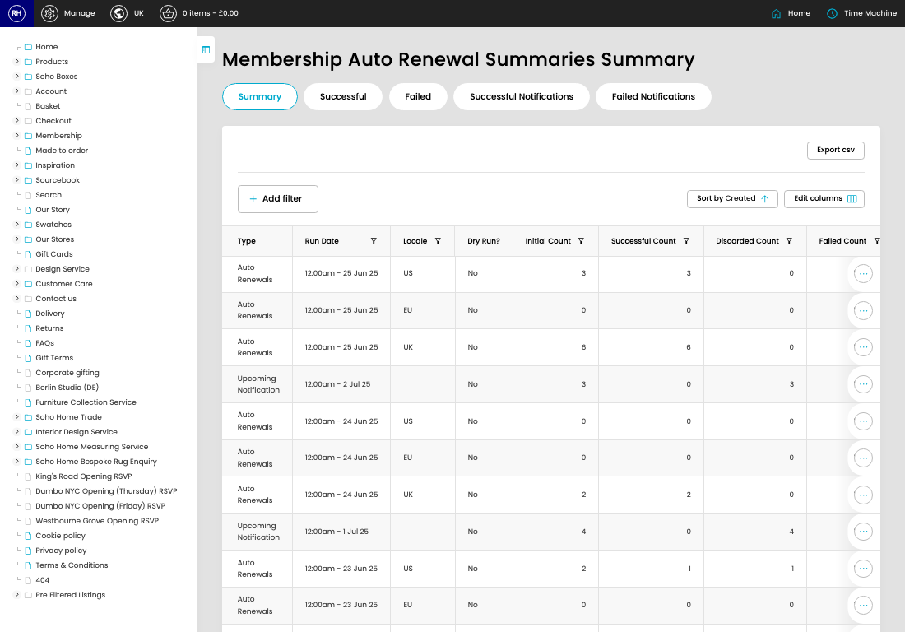

# Auto Renewal Summaries

[Home](../../index.md) / Auto Renewal Summaries

URL: [https://sohohome.com/cp/auto-renewal-summary-admin](https://sohohome.com/cp/auto-renewal-summary-admin)

Auto Renewal Summary.

*Auto Renewal Summaries page overview*

## Related Pages

- [View Auto Renewal Summary](../023-cp-auto-renewal-summary-admin-view-id-6650a104/README.md): Open an existing auto renewal summary when you need to check the full details.

## How It Works

- Update the crystallised membership fields from DigitalHouse or our applications model.
- Sync a customer's details down from digital house.
- The key fields are Type, Run Date, Locale, Dry Run?, and Initial Count, which explain what the record is for and how it can be used.

## Using This Page

1. Scan the fields in the table to find the auto renewal summary you need.

## What You Can Do

### Review auto renewal summaries

Review the visible fields to check what already exists.

- Visible fields include Type, Run Date, Locale, Dry Run?, Initial Count, Successful Count, Discarded Count, and Failed Count.

Example rows:

| Type | Run Date | Locale | Dry Run? | Initial Count | Successful Count |
| --- | --- | --- | --- | --- | --- |
| Auto Renewals | 12:00am - 25 Jun 25 | US | No | 3 | 3 |
| Auto Renewals | 12:00am - 25 Jun 25 | EU | No | 0 | 0 |
| Auto Renewals | 12:00am - 25 Jun 25 | UK | No | 6 | 6 |

## Page Sections

- Summary
- Successful
- Failed
- Successful Notifications
- Failed Notifications
