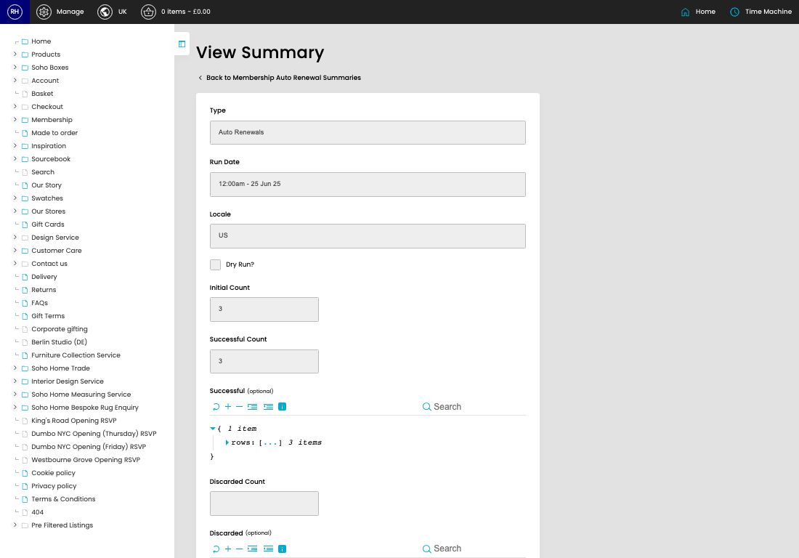

# Auto Renewal Summaries

[Home](../../index.md) / [Auto Renewal Summaries](../022-cp-auto-renewal-summary-admin-7af23be0/README.md) / View Auto Renewal Summary

URL: [https://sohohome.com/cp/auto-renewal-summary-admin/view/:id](https://sohohome.com/cp/auto-renewal-summary-admin/view/:id)

Auto Renewal Summary.

*Auto Renewal Summaries page overview*

## Related Pages

- [Auto Renewal Summaries](../022-cp-auto-renewal-summary-admin-7af23be0/README.md): Review the visible fields to check what already exists.

## How It Works

- Update the crystallised membership fields from DigitalHouse or our applications model.
- Sync a customer's details down from digital house.
- The key fields are Type, Run Date, Locale, Dry Run?, and Initial Count, which explain what the record is for and how it can be used.

## Using This Page

1. Open the existing auto renewal summary you need to review.
2. Use the visible fields to check the details.

## What You Can Do

### Review an existing auto renewal summary

Open an existing auto renewal summary when you need to check the full details.

## Key Settings

### Auto Renewal Summaries

#### Dry Run?

Turn this on when dry run? should apply. Leave it off when it should not.
