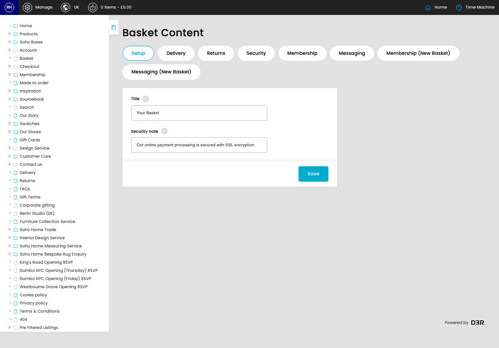
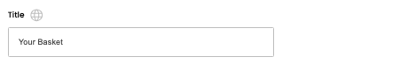

# Basket Sidebar content

[Home](../../index.md) / Basket Sidebar content

URL: [https://sohohome.com/cp/basket-admin](https://sohohome.com/cp/basket-admin)

Basket Sidebar content covers the admin screen used to review and maintain basket sidebar content.

*Basket Sidebar content page overview*

## Using This Page

1. Open the Basket Sidebar content screen.
2. Work through the fields that are relevant to the change, then save once the details are correct.

## What You Can Do

### Update settings

Use the fields on this screen to make the change, then save once the values are correct.

## Key Settings

### Basket Content

#### Title

*Title setting*

Add the title.

**Validation:** Required.

#### Security note

*Security note setting*

Add the security note.

**Validation:** Required.

## Available Actions

- Setup
- Delivery
- Returns
- Security
- Membership
- Messaging
- Membership (New Basket)
- Messaging (New Basket)
