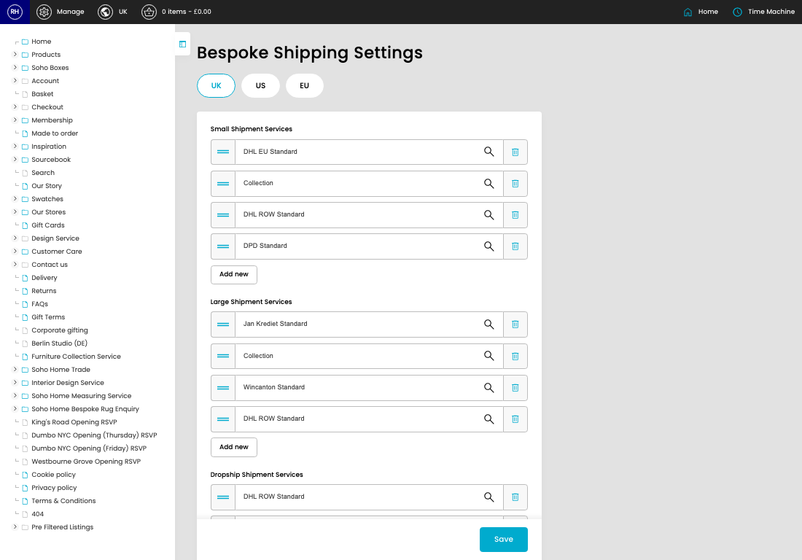
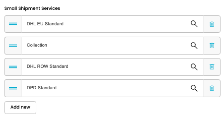
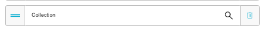
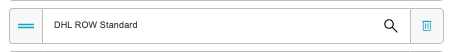
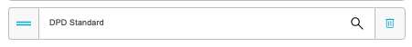
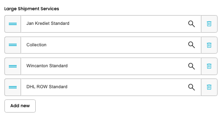
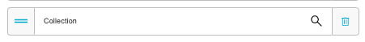
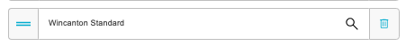
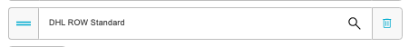

# Bespoke Shipping Settings

[Home](../../index.md) / Bespoke Shipping Settings

URL: [https://sohohome.com/cp/bespoke-settings-admin](https://sohohome.com/cp/bespoke-settings-admin)

Controller for bespoke settings

*Bespoke Shipping Settings page overview*

## How It Works

- The key fields are Small Shipment Services, Large Shipment Services, Dropship Shipment Services, Small Shipment Services, and Large Shipment Services, which explain what the record is for and how it can be used.

## Using This Page

1. Open the Bespoke Shipping Settings screen.
2. Work through the fields that are relevant to the change, then save once the details are correct.

## What You Can Do

### Update settings

Use the fields on this screen to make the change, then save once the values are correct.

## Key Settings

### Bespoke Shipping Settings

#### input

*input setting*

Add the input.

#### input

*input setting*

Add the input.

#### input

*input setting*

Add the input.

#### input

*input setting*

Add the input.

#### input

*input setting*

Add the input.

#### input

*input setting*

Add the input.

#### input

*input setting*

Add the input.

#### input

*input setting*

Add the input.

#### input

Add the input.

#### input

Add the input.

#### input

Add the input.

## Available Actions

- UK
- US
- EU
- Add new
