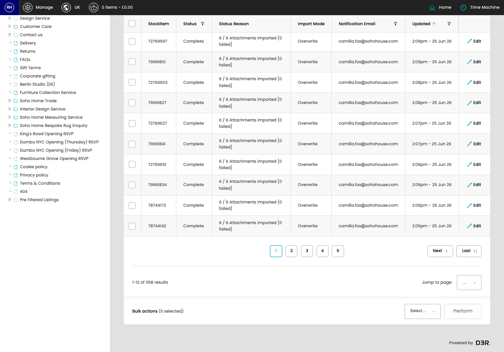
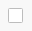
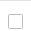
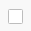

# BrandFolder Import Queue

[Home](../../index.md) / BrandFolder Import Queue

URL: [https://sohohome.com/cp/brandfolder-queue-admin](https://sohohome.com/cp/brandfolder-queue-admin)

BrandFolder Import Queue lets admins find and review existing brandfolder import queue.

*BrandFolder Import Queue page overview*

## Related Pages

- [Edit BrandFolder Import Queue](../029-cp-brandfolder-queue-admin-edit-33406-40b49745/README.md): Open an existing brandfolder import queue when you need to check the setup or make a change.

## Using This Page

1. Open BrandFolder Import Queue from the CP navigation.
2. Scan the fields in the table to find the brandfolder import queue you need.

## What You Can Do

### Review brandfolder import queue

Review the visible fields to check what already exists.

- Field: StockItem
- Field: Status
- Field: Status Reason
- Field: Import Mode
- Field: Notification Email
- Field: Updated

Example rows:

| StockItem | Status | Status Reason | Import Mode | Notification Email | Updated |
| --- | --- | --- | --- | --- | --- |
|  | 72769634 | Complete | 6 / 6 Attachments imported [0 failed] | Overwrite | camilla.fox@sohohouse.com |
|  | 79961858 | Complete | 6 / 6 Attachments imported [0 failed] | Overwrite | camilla.fox@sohohouse.com |
|  | 72769597 | Complete | 6 / 6 Attachments imported [0 failed] | Overwrite | camilla.fox@sohohouse.com |

## Key Settings

The sections below highlight the settings people are most likely to change.

### Bulk actions (0 selected)

#### input

*input setting*

Turn this on when input should apply. Leave it off when it should not.

#### input

*input setting*

Turn this on when input should apply. Leave it off when it should not.

#### model_listing[33406]

*model_listing[33406] setting*

Turn this on when model_listing[33406] should apply. Leave it off when it should not.

#### model_listing[33405]

*model_listing[33405] setting*

Turn this on when model_listing[33405] should apply. Leave it off when it should not.

#### model_listing[33404]

*model_listing[33404] setting*

Turn this on when model_listing[33404] should apply. Leave it off when it should not.

#### model_listing[33403]

*model_listing[33403] setting*

Turn this on when model_listing[33403] should apply. Leave it off when it should not.

#### model_listing[33402]

*model_listing[33402] setting*

Turn this on when model_listing[33402] should apply. Leave it off when it should not.

#### model_listing[33401]

*model_listing[33401] setting*

Turn this on when model_listing[33401] should apply. Leave it off when it should not.

#### model_listing[33400]

Turn this on when model_listing[33400] should apply. Leave it off when it should not.

#### model_listing[33399]

Turn this on when model_listing[33399] should apply. Leave it off when it should not.

#### model_listing[33398]

Turn this on when model_listing[33398] should apply. Leave it off when it should not.

#### model_listing[33397]

Turn this on when model_listing[33397] should apply. Leave it off when it should not.

#### model_listing[33396]

Turn this on when model_listing[33396] should apply. Leave it off when it should not.

#### model_listing[33395]

Turn this on when model_listing[33395] should apply. Leave it off when it should not.

#### select

Choose the option that matches this select.

**Options:** Cancel, Retry

## Available Actions

- Perform
