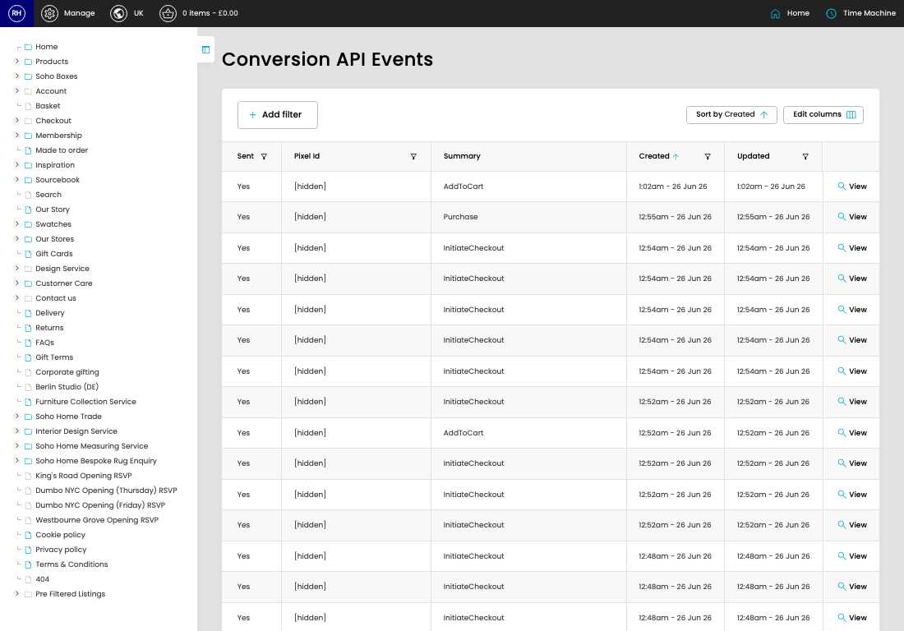

# Conversion API

[Home](../../index.md) / Conversion API

URL: [https://sohohome.com/cp/capi](https://sohohome.com/cp/capi)

Conversion API lets admins find and review existing conversion API.

*Conversion API page overview*

## Related Pages

- [View Conversion API](../031-cp-capi-view-id-52097ec6/README.md): Open an existing conversion API when you need to check the full details.

## How It Works

- The key fields are Sent, Pixel Id, Event, and Summary, which explain what the record is for and how it can be used.

## Using This Page

1. Scan the fields in the table to find the conversion API you need.

## What You Can Do

### Review conversion API

Review the visible fields to check what already exists.

- Visible fields include Sent, Pixel Id, Summary, Created, and Updated.

Example rows:

| Sent | Pixel Id | Summary | Created | Updated |
| --- | --- | --- | --- | --- |
| Yes | [hidden] | AddToCart | 1:02am - 26 Jun 26 | 1:02am - 26 Jun 26 |
| Yes | [hidden] | Purchase | 12:55am - 26 Jun 26 | 12:55am - 26 Jun 26 |
| Yes | [hidden] | InitiateCheckout | 12:54am - 26 Jun 26 | 12:54am - 26 Jun 26 |
