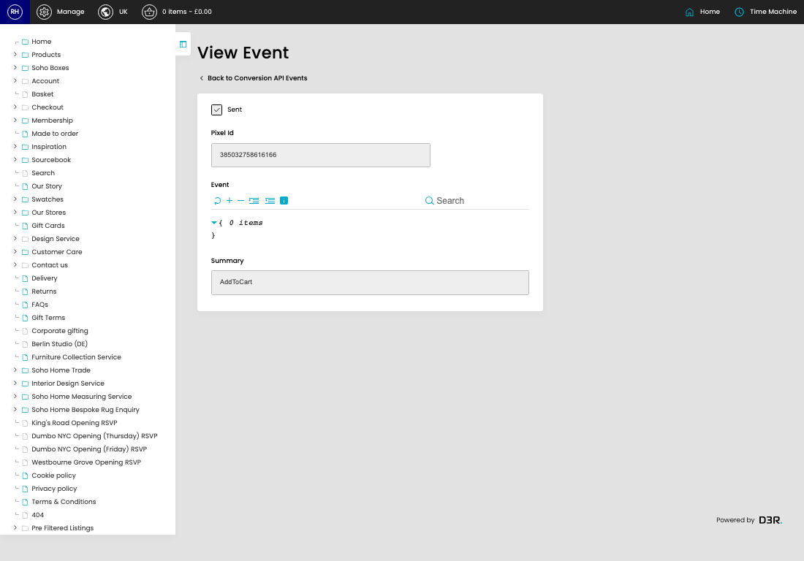
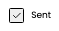

# Conversion API

[Home](../../index.md) / View Conversion API

URL: [https://sohohome.com/cp/capi/view/2809963](https://sohohome.com/cp/capi/view/2809963)

Conversion API covers the admin screen used to review and maintain conversion api.

*Conversion API page overview*

## Related Pages

- [Conversion API](../030-cp-capi-69b0428b/README.md): Review the visible fields to check what already exists.

## How It Works

- The key fields are Sent, Pixel Id, Event, and Summary, which explain what the record is for and how it can be used.

## Using This Page

1. Open the existing conversion API you need to review.
2. Use the visible fields to check the details.

## What You Can Do

### Review an existing conversion API

Open an existing conversion API when you need to check the full details.

## Key Settings

### Conversion API

#### Sent

*Sent setting*

Turn this on when sent should apply. Leave it off when it should not.
