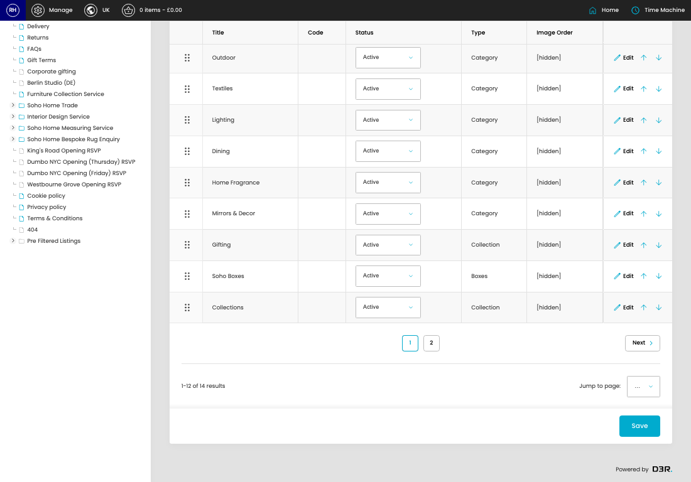

# Categories

[Home](../../index.md) / Categories

URL: [https://sohohome.com/cp/categories-admin](https://sohohome.com/cp/categories-admin)

Manage the categories

*Categories page overview*

## Related Pages

- [Create Category](../033-cp-categories-admin-edit-new-641fc46e/README.md): Use Create new when this category does not already exist. Complete the fields that describe it, then save.

## How It Works

- The key fields are Parent, Title, Code, Include products from subcategories and collections, and Exclude products from parent category, which explain what the record is for and how it can be used.

## Using This Page

1. Scan the fields in the table to find the category you need.

## What You Can Do

### Review categories

Review the visible fields to check what already exists.

- Visible fields include Title, Code, Status, Type, and Image Order.

Example rows:

| Title | Code | Status | Type | Image Order |
| --- | --- | --- | --- | --- |
|  | 20% off all seating |  | select… Active Members Only Hidden Inactive Archived | [hidden] |
|  | Furniture |  | select… Active Members Only Hidden Inactive Archived | [hidden] |
|  | Bathroom |  | select… Active Members Only Hidden Inactive Archived | [hidden] |

### Update settings

Use the fields on this screen to make the change, then save once the values are correct.

## Page Sections

- Online
- Archived
