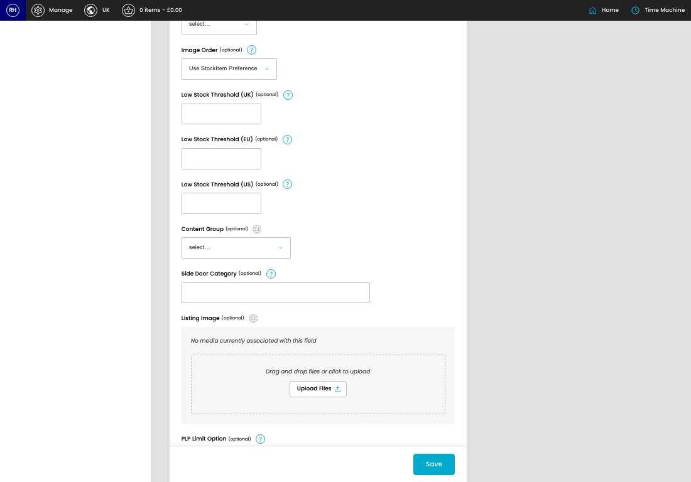
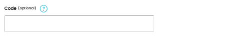
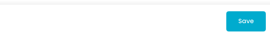

# Categories

[Home](../../index.md) / [Categories](../032-cp-categories-admin-6a47a3af/README.md) / Create Category

URL: [https://sohohome.com/cp/categories-admin/edit/new](https://sohohome.com/cp/categories-admin/edit/new)

Manage the categories

*Categories page overview*

## Related Pages

- [Categories](../032-cp-categories-admin-6a47a3af/README.md): Review the visible fields to check what already exists.

## How It Works

- The key fields are Parent, Title, Code, Include products from subcategories and collections, and Exclude products from parent category, which explain what the record is for and how it can be used.

## Using This Page

1. Create the new category from this screen.
2. Work through the fields that are relevant to the new record.
3. Save once the details are correct.

## What You Can Do

### Create a new category

Use Create new when this category does not already exist. Complete the fields that describe it, then save.

### Update settings

Use the fields on this screen to make the change, then save once the values are correct.

## Key Settings

### Create New Category

#### Title

*Title setting*

Add the title.

**Validation:** Required.

#### Code (optional)

*Code (optional) setting*

Add the code (optional).

**Notes:** This will be used during update/import from BC

#### Show Sale Products?

Turn this on when the answer should be yes. Leave it off when it should not apply.

#### Include products from subcategories and collections

Turn this on when include products from subcategories and collections should apply. Leave it off when it should not.

**Notes:** Only applicable for T1 categories

#### Show OOS Products?

Turn this on when the answer should be yes. Leave it off when it should not apply.

#### Url Name (optional)

*Url Name (optional) setting*

Add the url name (optional).

**Notes:** optional

#### Intro (optional)

Write the intro (optional) content.

#### Status

*Status setting*

Choose the option that matches this status.

**Options:** Active, Members Only, Hidden, Inactive, Archived

#### Type

Choose the option that matches this type.

**Options:** Category, Collection, Range, Sale, Mass Sale, Boxes

#### Metro type (optional)

Choose the option that matches this metro type (optional).

**Options:** Carpet / Area rugs, CaseGood, Lighting, Upholstery

**Notes:** optional

#### Image Order (optional)

Choose the option that matches this image order (optional).

**Options:** Lifestyle + Listing, Listing + Lifestyle, Use StockItem Preference

**Notes:** Preferred order for Product Card Images

#### Low Stock Threshold (UK) (optional)

Add the low stock threshold (UK) (optional).

**Notes:** What the maximum stock count is to display low stock badge on a UK PLP

#### Low Stock Threshold (EU) (optional)

Add the low stock threshold (EU) (optional).

**Notes:** What the maximum stock count is to display low stock badge on an EU PLP

#### Low Stock Threshold (US) (optional)

Add the low stock threshold (US) (optional).

**Notes:** What the maximum stock count is to display low stock badge on a US PLP

#### Content Group (optional)

Choose the option that matches this content group (optional).

**Options:** Rugs craftsmanship, Bathrooms by Soho House, Rugs: bespoke + craftsmanship, How to hang your curtains

**Notes:** optional

#### Side Door Category (optional)

Add the side door category (optional).

**Notes:** Full Side Door category path - separated by >eg: Furniture > Bedroom > Beds > Queen Beds]]>

#### PLP Limit Option (optional)

Choose the option that matches this PLP limit option (optional).

**Options:** Standard, Reduced, 40, 80

**Notes:** Standard: default limits, Reduced: max 40 limit, 40/80 set as default limit

## Page Sections

- Setup
- Upload Files
