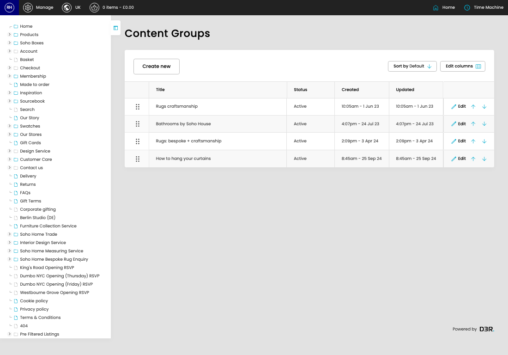

# Category Content Groups

[Home](../../index.md) / Category Content Groups

URL: [https://sohohome.com/cp/categories-content-admin](https://sohohome.com/cp/categories-content-admin)

Manage the categories

*Category Content Groups page overview*

## Related Pages

- [Edit Category Content Group](../035-cp-categories-content-admin-edit-id-5447f328/README.md): Open an existing category content group when you need to check the setup or make a change.

## How It Works

- The key fields are Title, Status, and Position, which explain what the record is for and how it can be used.

## Using This Page

1. Scan the fields in the table to find the category content group you need.

## What You Can Do

### Review category content groups

Review the visible fields to check what already exists.

- Visible fields include Title, Status, Created, and Updated.

Example rows:

| Title | Status | Created | Updated |
| --- | --- | --- | --- |
|  | Rugs craftsmanship | Active | 10:05am - 1 Jun 23 |
|  | Bathrooms by Soho House | Active | 4:07pm - 24 Jul 23 |
|  | Rugs: bespoke + craftsmanship | Active | 2:09pm - 3 Apr 24 |
