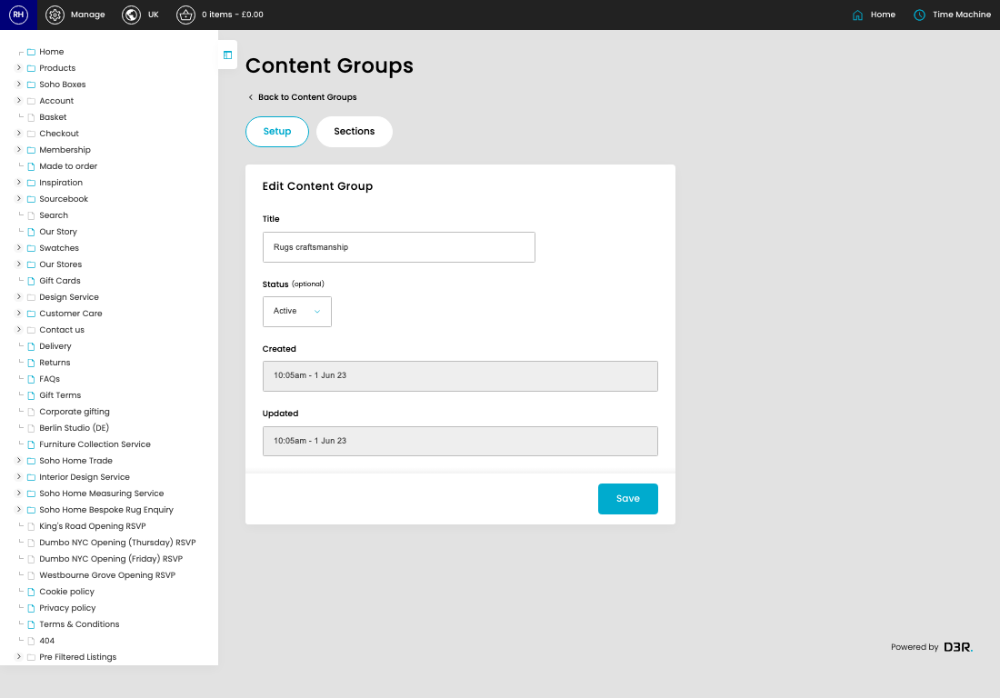
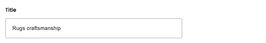

# Category Content Groups

[Home](../../index.md) / [Category Content Groups](../034-cp-categories-content-admin-0f3efb76/README.md) / Edit Category Content Group

URL: [https://sohohome.com/cp/categories-content-admin/edit/:id](https://sohohome.com/cp/categories-content-admin/edit/:id)

Manage the categories

*Category Content Groups page overview*

## Related Pages

- [Category Content Groups](../034-cp-categories-content-admin-0f3efb76/README.md): Review the visible fields to check what already exists.

## How It Works

- The key fields are Title, Status, and Position, which explain what the record is for and how it can be used.

## Using This Page

1. Open the existing category content group you need to change.
2. Work through the fields that are relevant to the change.
3. Save once the details are correct.

## What You Can Do

### Edit an existing category content group

Open an existing category content group when you need to check the setup or make a change.

- Save once the details are correct.

## Key Settings

### Edit Content Group

#### Title

*Title setting*

Add the title.

**Validation:** Required.

#### Status (optional)

*Status (optional) setting*

Choose the option that matches this status (optional).

**Options:** Active, Inactive

**Notes:** optional

## Page Sections

- Setup
- Sections
